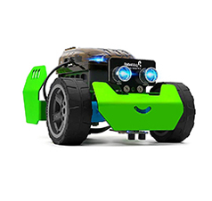
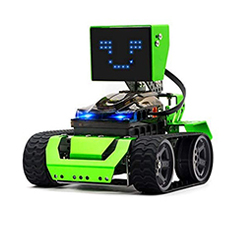

# Recursos Robobloq

Programas y recursos para los robots Q-Scout y Qoopers de Robobloq

|  |  |
|:------------------------------------------------:|:-------------------------------------------------:|
|                     Q-Scout                      |                      Qoopers                      |

## Recursos

### Guías didácticas

#### Q-Scout

* [MATEBOT: Robótica y programación para la educación primaria](documentos/guias_didacticas/q-scout/mate-bot-primaria.pdf) [(fuente)](https://www.educ.ar/recursos/132637/guia-didactica-del-eje-matebot)
* [Manual Didáctico Q-Scout: Robótica Educativa - Nivel Primario](documentos/guias_didacticas/q-scout/manual_didactico_Q-Scout-robotica_educativa–nivel_primario.pdf) [(fuente)](http://portaleducativo.sanjuan.edu.ar/biblioteca-virtual/contenidos-digitales-5-2021/)
* [Curso empleando el robot Q-Scout (en inglés)](documentos/guias_didacticas/q-scout/Q-scout-course-EN.pdf)

#### Qoopers

* [EMOTIBOT: Robótica y programación para nivel secundario](documentos/guias_didacticas/qoopers/emotibot-secundaria.pdf) [(fuente)](https://www.educ.ar/recursos/150809/guia-didactica-del-eje-emotibot-para-nivel-secundario) 
* [Saberes Digitales: Robot Móvil](documentos/guias_didacticas/qoopers/manual_didactico-robot_movil.pdf) [(fuente)](https://saberesdigitales.educar.gob.ar/ROBOT%20M%C3%93VIL)

### Videos

* Componentes y funcionamiento (Educ.ar): [(Q-Scout)](https://youtu.be/ZbRXh4Qp3H4) / [(Qoopers)](https://youtu.be/wlSzMchmNv4)
* Piezas y armado (Educ.ar): [(Q-Scout)](https://youtu.be/1GOGrhFAbOU) / [(Qoopers)](https://youtu.be/mx_AlqYXsVQ)
* Entorno de programación (Educ.ar): [(Q-Scout)](https://youtu.be/jnZPlkyZGks) / [(Qoopers)](https://youtu.be/uwcX6-5oJ6w)
* [Aprende Robobloq desde Cero (TecnificaMe)](https://www.youtube.com/playlist?list=PL1mTSmNi7RdKwa_sdSkQFPJGs9di_himr)

### Manuales

* Manual de usuario del robot Q-Scout [(en español)](documentos/manuales/q-scout/manual-Q-Scout-v02.pdf) [(en inglés)](documentos/manuales/q-scout/Q-scout_User_Manual.pdf)
* Manual de usuario del robot Qoopers [(en español)](documentos/manuales/qoopers/manual-Qoopers-v02.pdf) [(en inglés)](documentos/manuales/qoopers/Qoopers-User_Manual.pdf)

### Diagramas Esquemáticos

#### Q-Scout

* [Diagrama placa Qmind](documentos/open_hardware/qmind/K2-Mainboard-SCH.pdf)

#### Qoopers

* [Diagrama placa Qmind Plus](documentos/open_hardware/qmind_plus/K1-Mainboard-SCH.pdf)
* [Diagrama matriz de LEDs](documentos/open_hardware/qmind_plus/K1-LED-V2.0-SCH.pdf)

#### Sensores

* [Diagrama sensor seguidor de líneas](documentos/open_hardware/electronic_module/Line_Follower_Sensor-V1.0-SCH.pdf)
* [Diagrama sensor ultrasónico](documentos/open_hardware/electronic_module/Ultrasonic_Sensor-V1.0-SCH.pdf)
