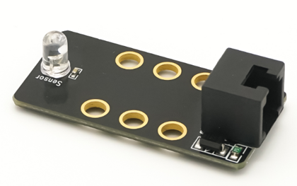
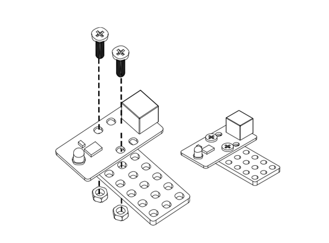
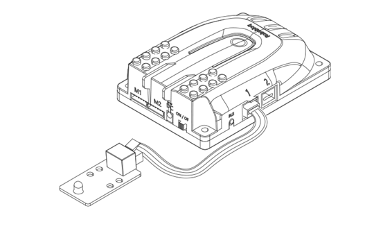
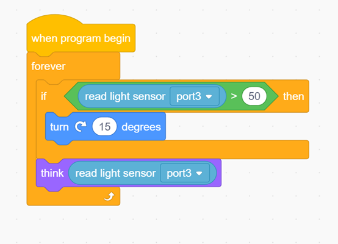
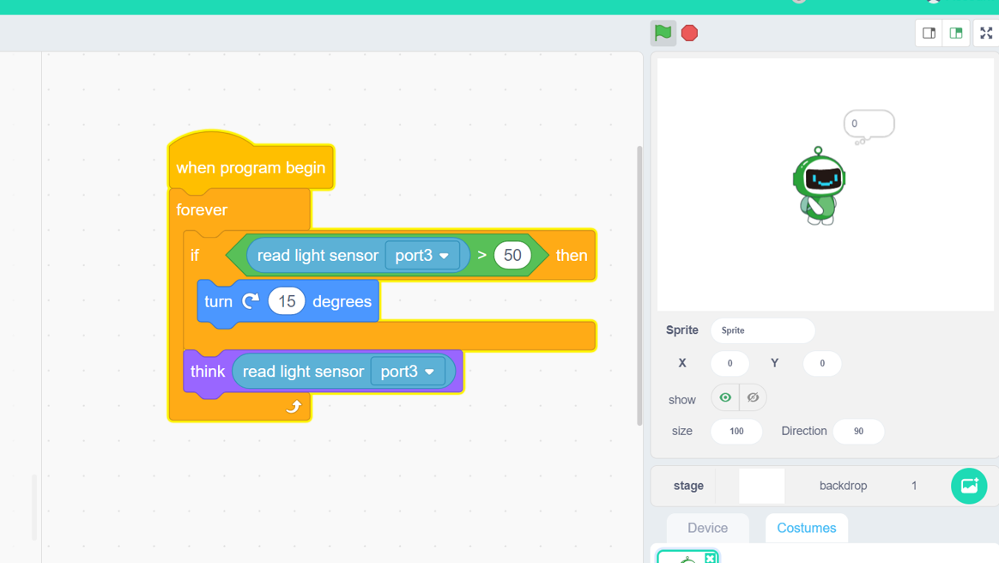

# 1. Light Sensor

# Light Sensor

##  
## I. Overview
The light sensor is developed based on the photoelectric effect principle of semiconductors. 

The main component of this sensor is a phototransistor and it can be used to detect the intensity of ambient light. Its electrical resistance decreases as the intensity of light increases. Via connecting in series with another resistor, the phototransistor will output divided voltage value of its own resistor, this whole process can convert the variable optical signal intensity into an alterable electrical signal value, then it will output it from the analogue port.

It is usually used to produce interactive works that produce special effects as light intensity changes, such as smart table lamp robots and light tracking robots.

** **

## Ⅱ.Specifications
 

| Operating   Voltage | DC   5V  |
| --- | --- |
| Range of working temperature | -30   ° C to 70 ° C |
| Module size | 50   x 24 x 15 mm ( length x width x height ) |
| Output  | Analogue   value 0-1023 |
| Reference | Exposure   to daylight (> 500), night (0 to 100), indoor lighting (100 to 500) |

** **

** **

## Ⅲ.Characteristics
a)    The light sensor supports Arduino IDE programming, and provides runtime libraries to simplify programming.

 

b)   The sensor is available for Robobloq-APP and MyQode-PC GUI operating based on scratch,  suitable for all ages.

 

c)    It can be used for installation with M4 holes, compatible with Robobloq metal-related robots and Lego blocks.

 

d)    Having an RJ11 interface makes it convenient to connect to any black port on the Q-mind series motherboards. (Both Q-mind and Q-mind plus included)

 

e)  After the robot successfully connects to the PC, the sensor name will pop out automatically, and the sensor name can be seen in the console on the APP side.

 

## Ⅳ. Method of use
** **

### a) Assembly     
It has six mounting holes. When setting up, kindly pay attention to get metal parts away with components on the circuit board in case that component damage or short circuit happens. 

 

### b) Connection    
The black RJ11 interface connected to Qmind and Qmind plus can help the sensor get power and communication to the motherboard.

 

 

### c) Programming statement block 
| ****  | ParameterⅠ: Port | return value |
| :---: | --- | --- |
| | Q-mind   range 1 ~ 3 Q-mindplus range 2 ~ 7 | The return value   ranges from 0   to 1023. The larger the   return value, the brighter the intensity. |

 

### d) Application case     
#### 01 [ PC-MyQode sensor interacts with the character]
**                                                                                                              **

**Instruction:**

1. Find the sentence block of **[Light Sensor Value]** in the block console on the left.

2. Embed green block (suggesting a comparison function) and yellow blocks（suggesting “if” and “repeat”）

3. Let the character in the upper right corner read the value of **[Light Sensor]**;

4. When the **[Light Sensor]**value is greater than 50, the robobloq role will keep always rotating; and the sensor value will be reported and pop up out of his mouth.

                                                   

#### 02 [ APP-Robobloq sensor interacts with a robot]
Overview for the case performance:

When the power is turned on, the dual lights on the motherboard light up blue. When the light sensor detects the bright lights, the dual lights turn red and a sound is emitted.

 

##### Instruction steps:
1. Connect the **light sensor **to port 3 of the main control board.

2. Set the program as shown above.

3. Press the “Run” button in the lower right corner to start the program.

## V. Schematic
[https://github.com/Robobloq2018/Open-source-hardware/blob/master /Electronic%20module/Light%20Sensor-V1.0-SCH.pdf](https://translate.google.com/translate?hl=zh-CN&prev=_t&sl=auto&tl=en&u=https://github.com/Robobloq2018/Open-source-hardware/blob/master/Electronic%2520module/Light%2520Sensor-V1.0-SCH.pdf)

 

 

---

 

> 更新: 2020-12-02 01:08:03  
> 原文: <https://www.yuque.com/robobloq/gb7mwf/psf865>