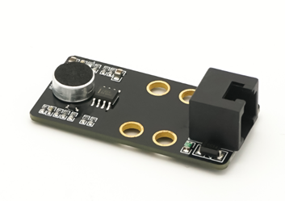
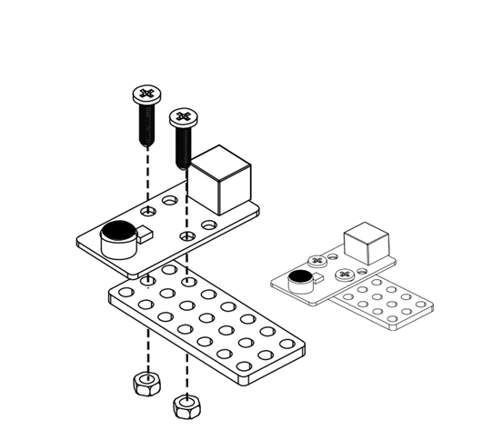
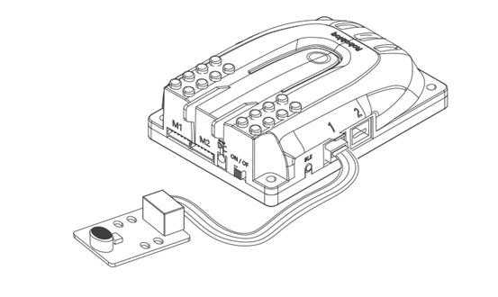
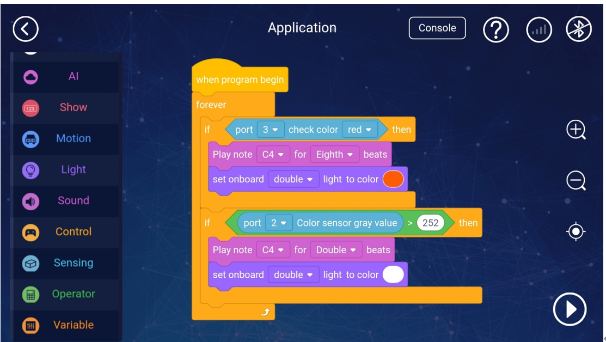

# 2. Sound Sensor

# Sound sensor

 

##  I. Overview
The sound sensor is based on a microphone to detect the intensity of sound in the surrounding environment. It can be used to do some projects that interact with sounds, such as high-five robots. 

 

## Ⅱ. Specifications     
| Operating Voltage | DC 5V |
| --- | --- |
| Return value  | analog value: 0 ~ 1023   digital value: 0 , 1 |
| Module size | 50 x 24 x 15 mm   (length x width x height) |

** **

## Ⅲ. characteristics
a)    The light sensor supports Arduino IDE programming and provides runtime libraries to simplify programming.

 

b)    The sensor is available for Robobloq-APP and MyQode-PC GUI operating based on scratch,  suitable for all ages.

 

c)    It can be used for installation with M4 holes, compatible with Robobloq metal-related robots and Lego blocks.

 

d)    Having an RJ11 interface makes it convenient to connect to any black port on the Q-mind series motherboards. (Both Q-mind and Q-mind plus included)

 

e)  After the robot successfully connects to the PC, the sensor name will pop out automatically, and the sensor name can be seen in the console on the APP side.

 

## Ⅳ.Method of use
### a) Assembly     
It has six mounting holes. When setting up, kindly pay attention to get metal parts away with components on the circuit board in case that component damage or short circuit happens. 

### b) Connection    
The black RJ11 interface connected to Q-mind and Q-mind plus can help the sensor get power and communication to the motherboard.

 

 

 

After the connection is completed, the name of the connected module will pop up on the PC side, and the corresponding port can also be checked in the APP console.

### c) Programming statement block     
  

|     | ParameterⅠ Port | return value |
| --- | --- | --- |
| | Qmind   range 1 ~ 3 Qmind   plus range 2 ~ 7 | The return value   ranges from 0   to 1023. The larger the   return value, the stronger the sound intensity. |

 

### d) Application case     
The following is an example of how to use [APP-Robobloq] to control the sound sensor:

Connect the motherboard and the sound sensor, and select the corresponding sentence block and port in “My Application” for programming as follows:

 

 

#### Overview for the case performance:
when the sound range is 185-380, green light and sound are emitted, and when the sound range value is higher than 380, blue light and other sound are emitted.

 

#### Instruction steps:  
 

1.  Connect the sound sensor to port 6 of the main control board

2.  Set the program as shown above

3.  Press the “Run”button in the lower right corner to start the program.

** **

** **

## Ⅴ. Schematic
[https://github.com/Robobloq2018/Open-source-hardware/blob/master/Electronic%20module/Sound%20Sensor-V1.0-SCH.pdf](https://translate.google.com/translate?hl=zh-CN&prev=_t&sl=auto&tl=en&u=https://github.com/Robobloq2018/Open-source-hardware/blob/master/Electronic%2520module/Sound%2520Sensor-V1.0-SCH.pdf)

 

 

 

> 更新: 2020-12-02 01:08:03  
> 原文: <https://www.yuque.com/robobloq/gb7mwf/oauoyw>