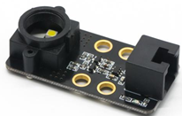
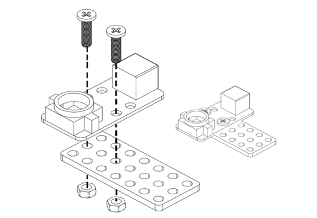
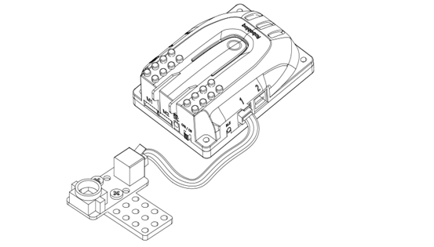
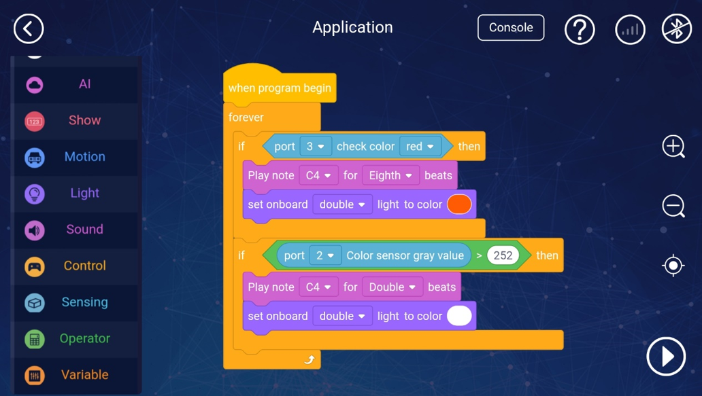
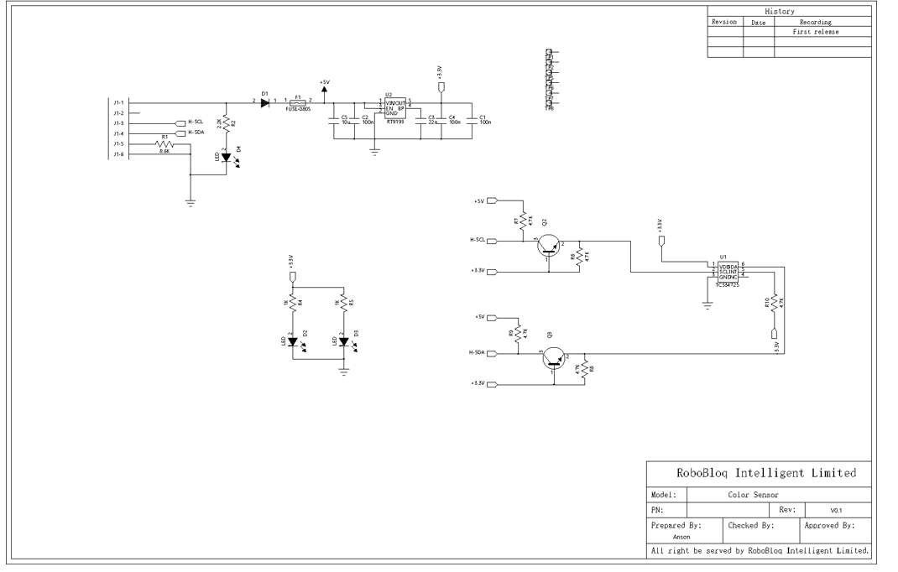
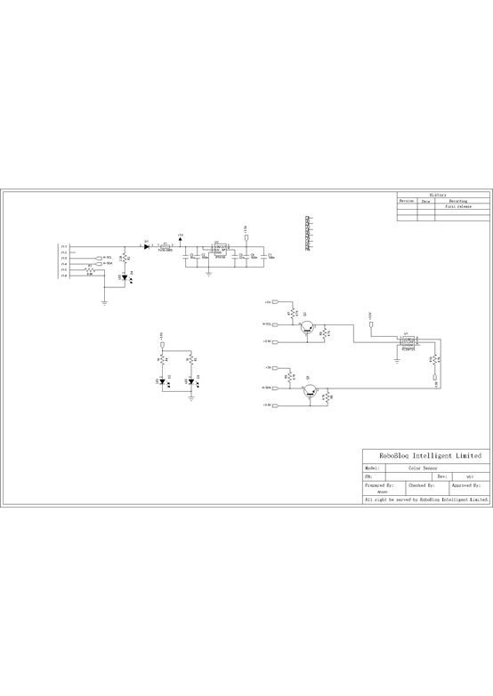

# 4. Color Sensor 

# Color sensor

## Ⅰ. overview 
The color sensor is a full-colour color sensor, including a TAOS TCS4725RGB sensor chip and 2 white LEDs and level conversion circuit, which can accurately detect 6 colours: yellow, red, blue, green, purple, and white.

This sensor can also be used as a grayscale sensor to identify the grayscale of the color.

** **

## Ⅱ. Specifications
| Operating Voltage | DC 5V |
| --- | --- |
| Working   current | 55mA |
| Operating   temperature | -20 - 60 ℃ |
| Signal   mode | I2C |
| Module   size | 50 * 24 * 15 mm |
| Measuring   range | RGB 0-255 , grayscale 0 - 100 |
| Detection   distance | 0-10mm |

 

 

## Ⅲ. Characteristics
a)    The color sensor supports Arduino IDE programming and provides runtime libraries to simplify programming.

b)   The sensor is available for Robobloq-APP and MyQode-PC GUI operating based on scratch,  suitable for all ages.

c)    It can be used for installation with M4 holes, compatible with Robobloq metal-related robots and Lego blocks.

 

d)    Having an RJ11 interface makes it convenient to connect to any black port on the Q-mind series motherboards. (Both Q-mind and Q-mind plus included)

 

e)  After the robot successfully connects to the PC, the sensor name will pop out automatically, and the sensor name can be seen in the console on the APP side.

 

## Ⅳ. Method of use
### a) Assembly.
The module has four M4 screw holes, which can be used to fix the module to the Robobloq robot metal platform. It is also compatible with the LEGO system round pin.

### b) Wiring
Connect this module to any black RJ11 port of the Qmind series main control board, as shown in the below picture:

 

 

After connection, the name of the connected module will pop up on the PC software, and the corresponding port can be checked in the APP.

 

### c)  Programming statement block
 [Stage interaction]Connect the robot to PC, then find the robot instruction in the character Sprite, click each sentence block to debug the robot online, and get the return value of the joystick module in real-time. (Later you can directly debug online in the robot character)

 

[Online and offline programming] The sentence block of the colour sensor module is in the "sensor" sentence block.

1.   statement block for Color return value  (type: sensor)

2.   statement block for Grayscale return value

3.   Statement block for colour judgement

|     | parameter: port | Output |
| --- | --- | --- |
| | Qmind 123 Qmind plus2~7 range2~7 | 0(none), 1(red),    2(green), 3(blue), 4(yellow), 5(purple), 6(white) |
|  | Qmind 123 Qmind plus2~7 range2~7 | 0(white)-100 (black) |
|  | Qmind 123 Qmind plus2~7 range2~7 | True/False |

                                                            c

### d)   Application Case
 

**[APP-Robobloq sensor interacts with a robot]**

##### Overview for the case performance:
1.    After main control board is turned on, the program starts to run, place a red book under the color sensor, the main control board will recognize the red color and emit a short "beep" sound (C4 tone, one-eighth of a beat). ), the on-board light turns red.

2.    If the color sensor is placed on a white book cover, the main control board will emit a long beep sound, and the on-board light turns white.

 

##### Instruction steps:
a)  Connect the color sensor to port 3 of the main board

b)   Set up the program as shown above

c)  Press the run button in the right bottom corner to start the program.

 

##### Expansion
Principle: Grayscale is a value that indicates the brightness of the image, that is, the colour depth of the points of the black and white image, which generally ranges from 0 to 255, white is 255, and black is 0, so black and white pictures are also called grayscale images. The grey value refers to the brightness of a single pixel. The larger the grey value, the brighter it is.

## V. Schematic
 

> 更新: 2020-12-02 01:30:32  
> 原文: <https://www.yuque.com/robobloq/gb7mwf/kl2g8z>