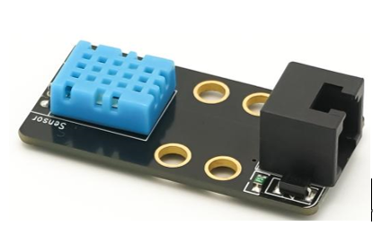
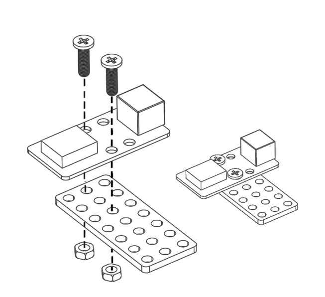
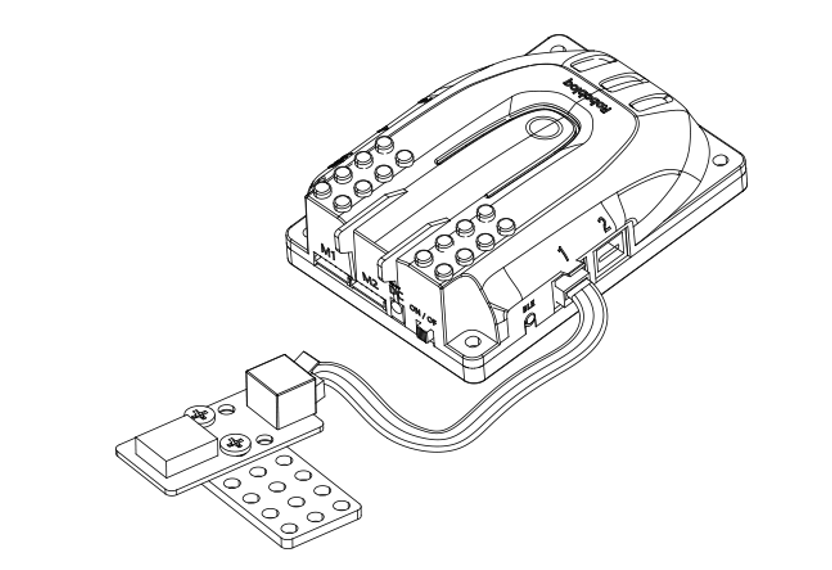
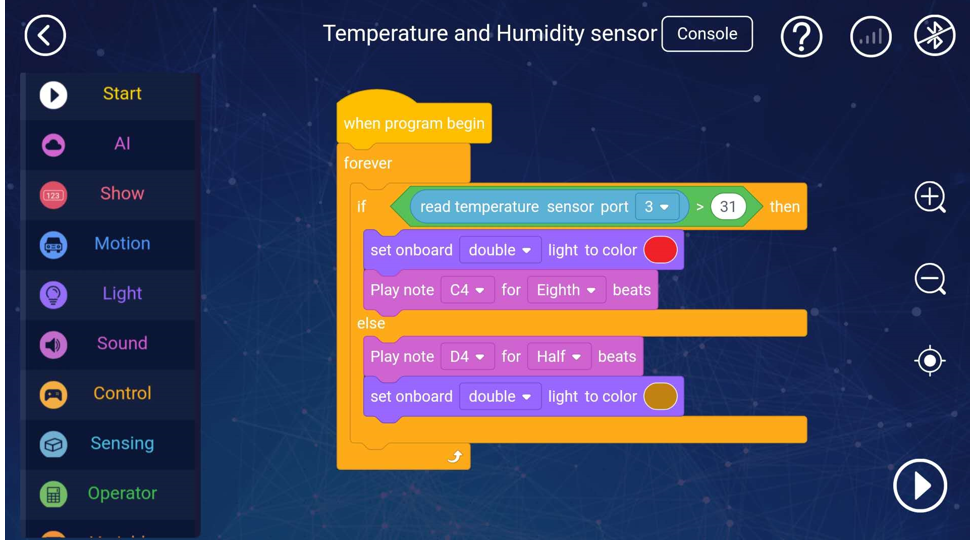
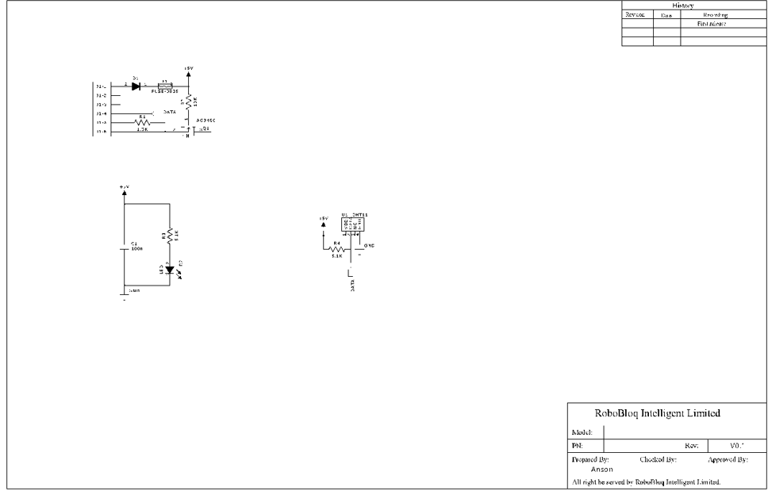

# 5. Temperature and Humidity sensor

# Temperature and humidity sensor

## I. Overview
Temperature and humidity sensor is a sensor that contains the output of digital signal, it uses the specific technique of temperature and humidity sensing, to assure its high reliability and outstanding cyclic stability,  it detects temperature and humidity changes in the surrounding environment.   

## Ⅱ.Specifications
| Operating   Voltage |  5V DC |
| --- | --- |
| control type | Single bus digital   signal |
| Output   current |  max 2.5mA |
| Range of   temperature detection  |  0-50℃ (±2℃) |
| Range of   humidity detection |  20-90% RH (±5%RH) |
| Accuracy |  ±1%RH, ±1℃ |
| Size of   Module | 51 x 24 x 18mm |

 

## Ⅲ.Characteristics
a)     Small size and low power consumption

b)    Strong anti-interference ability

c)    Digital output for total calibration

d)    Support Arduino IDE programming, and provide runtime to simplify programming

e)    The RJ11 interface is convenient for wiring, and the module can be connected to any black port of the Qmind series motherboard.

f)      Support Robobloq-APP / MyQode-PC graphical programming, suitable for all age users.

## Ⅳ. Method of use
### a)  Assembly。
The module has 4 M4 screw mounting holes, which can be used to fix the module to the metal platform of the Robobloq robot. It is also compatible with the LEGO system round hole latch

### b) connection
Connect this module to any black RJ11 port of Qmind series board.

 

 

Module’s name pops out automatically when connected to the PC. 

### c) Programming block
【Stage interaction】When robot connects to PC，find customs-Sprite- 之后在角色Sprite, click on the blocks to debug the robot online, get the return value of the joystick module in real-time. (Robot character can be debugged directly later on L)

[Online and offline programming] The joystick module sentence block is in the "sensor" sentence block；

**1.****Temperature and humidity sensor block**

|   | Parameter 1: port | Return value |
| --- | --- | --- |
| | Qmind range 1~3 Qmind plus range   2~7 | Output humidity   value in air (15-95)% RH |
|  | Qmind range 1~3 Qmind plus range   2~7 | Output air   temperature value (-2 ~ 52) ℃ |

** **

### d) Application case
**【****APP-Robobloq sensor-robot interaction ****】**

**Overview for the performance case****：**

1.  When the main control board is turned on, run the program.

2.  Touch the temperature and humidity sensor with a wet paper towel, the main control board emits a dripping sound, and the onboard lamp flashes red.

3.   Because it takes a certain time for the water vapour to dissipate, after a certain time, the main control board sends a sound of dripping, and the on-board lamp flashes the mustard yellow light. 

** **

**Instruction steps **

1. Connect the temperature and humidity sensor to port 3 of the main control board

2. Set up the program as shown above

3. Press the run button in the lower right corner to start the program.

## Ⅴ.Schematic

> 更新: 2020-12-02 01:08:03  
> 原文: <https://www.yuque.com/robobloq/gb7mwf/cywlx1>