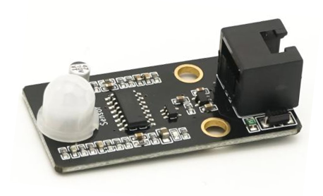
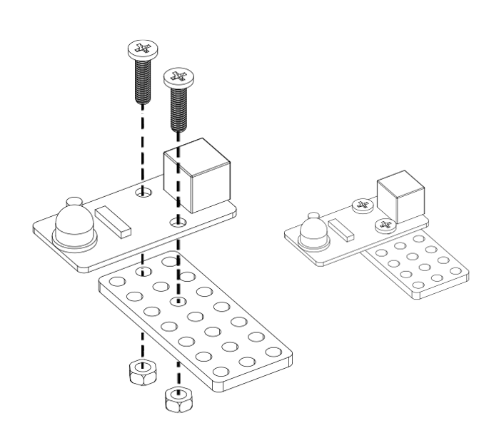
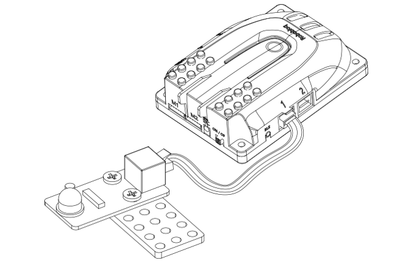
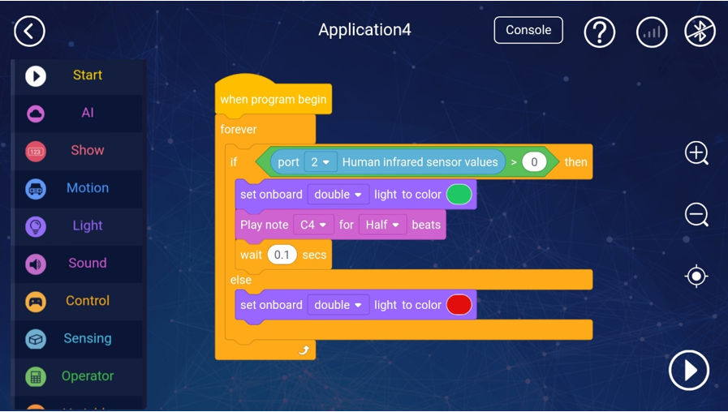
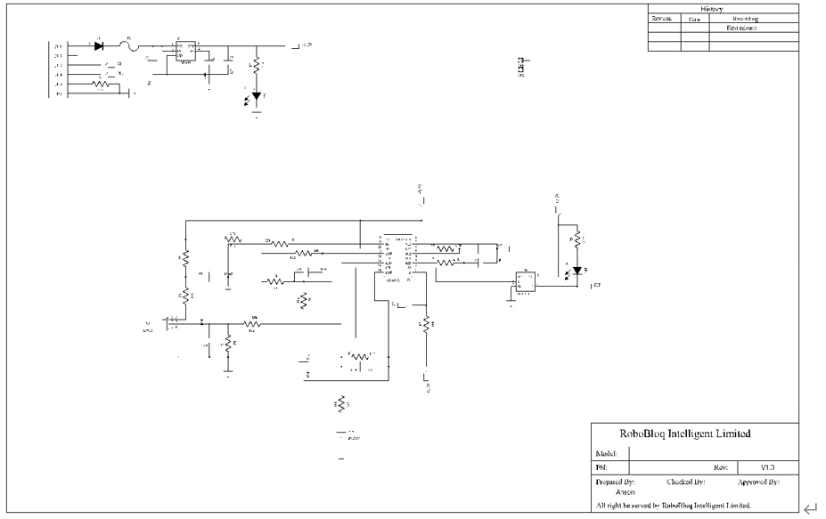

# 6. PIR Sensor 

** **

**PIR Motion Sensor**

** **

## I. Overview
The PIR motion sensor is a module for detecting infrared radiation emmited by human or animal, and the maximum measurement distance is 6m, if someone moves within this range, the DO pin will output a valid signal and the blue LED on the board will be lit. This module transmits the value to the Qmind series main control board through the RJ11 cable, and connects to the black interface on the main board.

 

## Ⅱ. Specifications
| Operating Voltage | 5V DC |
| --- | --- |
| Working   Current | 35 ma |
| Return | Digital value: 0 , 1 |
| Output   Voltage | 5 V /High Voltage0 V /Low Voltage |
| Trigger   Signal | 5 V / High Voltage |
| Hold time | 2(seconds) |
| Detection   Angle | 120(degree) |
| Detection   Distance | 6(6m max) |
| Size | 50 * 24 * 15 mm |

** **

## Ⅲ. Characteristics
**a)  ****Internal bi-directional discriminator can effectively suppress interference;**

**b)    ****The human body infrared sensor has two working modes: one is the storage mode, which is always on after the object is detected; the other is the cyclic trigger mode, which can continuously detect and keep on and off. This module uses the trigger mode.**

c)     The PIR sensor supports Arduino IDE programming, and provides runtime libraries to simplify programming.

d)     The sensor is available for Robobloq-APP and MyQode-PC GUI operating based on scratch,  suitable for all ages.

 

e)     It can be used for installation with M4 holes, compatible with Robobloq metal-related robots and Lego blocks.

 

f)      Having an RJ11 interface makes it convenient to connect to any black port on the Q-mind series motherboards. (Both Q-mind and Q-mind plus included)

 

g)       After the robot successfully connects to the PC, the sensor name will pop out automatically, and the sensor name can be seen in the console on the APP side.

 

 

## Ⅳ. Method of use
### a) Assembly     
It has 2 mounting holes.When setting up, kindly pay attention to get metal parts away with components on the circuit board in case that component damage or short circuit happens. 

### b) Wiring
The black RJ11 interface connected to Qmind and Qmind plus can help the sensor get power and communication to the motherboard.

  

 

After the connection is completed, the name of the connected module will pop up on the PC side, and the corresponding port can also be checked in the APP console.

 

### c) Programmingmming statement block
** ****[Stage interaction] **Connect the robot to PC, then find the robot instruction in the character Sprite, click each sentence block to debug the robot online, and get the return value of the joystick module in real time. (Later you can directly debug online in the robot character)

 

**[Online and offline programming]** The sentence block of the color sensor module is in the "sensor" sentence block.

**1.   ****The sentence block of joystick value**

** **

|     |   Parameter-Port |   Return Value |
| --- | --- | --- |
| | Qmind1~3 Range1~3 Qmind plus2~7 Range2~7 | It can output the infrared value detected by PIR   sensor, return value is 0 or 1, 0 is no signal detected, 1 means a signal   is  detected |

** **

### d) Application Case
**APP-Robobloq Sensor interacts with robot**

** **

Overview for the case performance:

1.  After the main control board is turned on, program starts to run.

2.  Touch the round white cap of PIR motion sensor with your hand, or wave your fingers in front of the round white cap, the on-board light turns green and emits a "drop"  sound 

3.  Keep away from the round white cap, the main board will stop making sound and the green light turns red.

**Instruction steps:**

1.   Connect the PIR motion sensor to Port3 of the main control board. 

2.   Set up the program as show above

3.   Press the run button in the right bottom corner to start the program.

 

## V. Schematic
** **

> 更新: 2020-12-02 01:08:03  
> 原文: <https://www.yuque.com/robobloq/gb7mwf/fwvgq9>