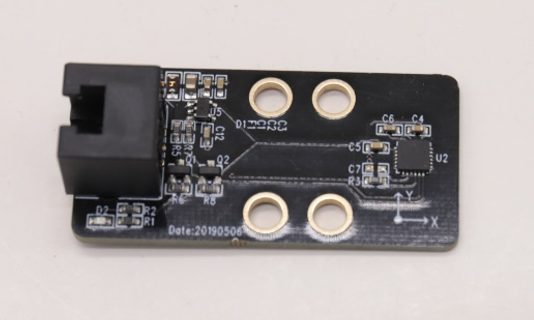

# 7. Gyroscope Sensor

#  Gyroscope Sensor

## Ⅰ.Introduction
Gyroscope sensor is an ideal sensor for motion detection and posture detection. The sensor includes 3-axis accelerometer, 3-axis angular velocity sensor and motion processor, as well as I2C interface communication. The sensor may apply on self-balance cars, 4-axis drones, robots and mobile devices, it also has a wild range of motion detection, low power consumption and another advantage. The sensors interface is white colour scale, which means it is I2C interface communication and it could connect to Qmind series board for more interest case of robot operating

 

## Ⅱ.Technical specifications
 

| Working   Voltage | **5V** |
| --- | :---: |
| Working   current | **20mA** |
| Max current | **100MA** |
| Working   temperature | **-20-55** |
| Communication   method | **IIC** |
| Module size | **50 x 24 x 15 mm ** |

 

 

## Ⅲ.characteristics 
 

a)     Anti-reversed-voltage- polarity: It could be protective for the sensor even when connecting the wire to the motherboard reversely or wrong.

b)      Having an RJ11 interface makes it convenient to connect to any black port on the Q-mind series motherboards. (Both Q-mind and Q-mind plus included)

c)       It can be used for installation with M4 holes, compatible with Robobloq metal-related robots and Lego blocks.

d)     It provides outputs for digital and analogue signal.

e)       The flame sensor supports Arduino IDE programming, and provides runtime libraries to simplify programming;

f)      The sensor is available for Robobloq-APP and MyQode-PC GUI operating based on scratch,  suitable for all ages;

g)     After the robot successfully connects to the PC, the sensor name will pop out automatically, and the sensor name can be seen in the console on the APP side.

** **

## Ⅳ.Instructions
### a) assembling
with 4 mounting holes, to be careful to avoid damaging the components onboard or causing short circuit

 

** **

### b) connection

Connect the module and Robobloqs Qmind series motherboard

After connection, the PC will pop up the name of the module

### c) block programming
stage interaction connects the PC to the robot, afterwards, choose Robobloq command in role Sprite. Click every block could manipulate robot online and set the control state of the module in real-time.

online and offline programming

Flame sensor modules block is at sensor block.

### d) Block example
1. return value block (catalog: sensor)

| **** ****      ** ** **** **                       ** | ** ** **Params: port** | ** ** **Return   value** |
| :---: | --- | --- |
| | ** ** ** ** **Qmind 123** **Qmind plus range in 2~7** | **User may select the port that corresponds to the one   to connect with sensor. The module could display the value on x, y and z   axises** **X axis -90**°—**90**° **Y axis -90**°—**9****0**° **Z axis ****0-360**°** ** |

** **

** **

### e) PC Case 
**a)  ****Connect the gyroscope sensor to the port 7 with RJ11 wire**

**b)  ****Set the block as the figure above**

**c)  ****Click the red flag at the bot-right corner to run the program**

** **

**Overview for the case performance**

**1.  ****this case is only illustrating the processing of reading value of gyroscope.**

**2.  ****to read the value on the screen, you need to move the gyroscope in x, y and z-direction.**

**3.  ****The role robobloq display the value which is corresponding to the x, y and z-direction. **

** **

### f)  APP application case
**Instruction steps:**

**1.  ****Connect gyroscope to the board at port 7**

**2.  ****Set the block like the figure above**

**3.  ****Click the play button to run the program**

** **

****

**overview of the performance case:**

**1.  ****7X<0180If the value from port 7 of gyroscope sensors X direction is less than 0, the onboard green light will on; if the turning angle is larger than 180 degrees, the blue light will on**

**2.  ****7y<0, 180 the value from port 7 of gyroscope sensors y-direction is less than 0, the onboard green light will on, if the turning angle is larger than 180, the blue light will on.**

**3.  ****7Z****<****180180 the value from port 7 of gyroscope sensors Z direction is less than 0, the onboard green light will on, if the turning angle is larger than 180, the blue light will on.**

** **

**Purpose: for practising the position of gyroscope and corresponding angle and posture.**

 

** **

** **

** **

** **

** **

> 更新: 2020-12-02 01:08:03  
> 原文: <https://www.yuque.com/robobloq/gb7mwf/eaiby9>