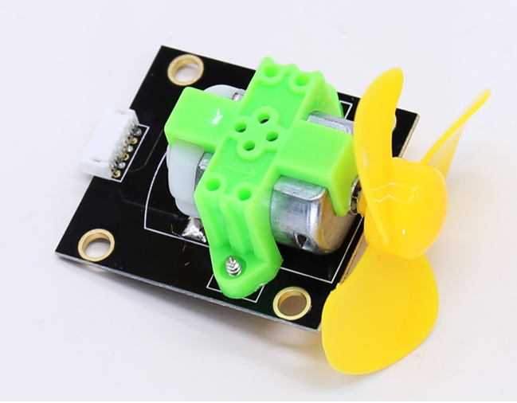
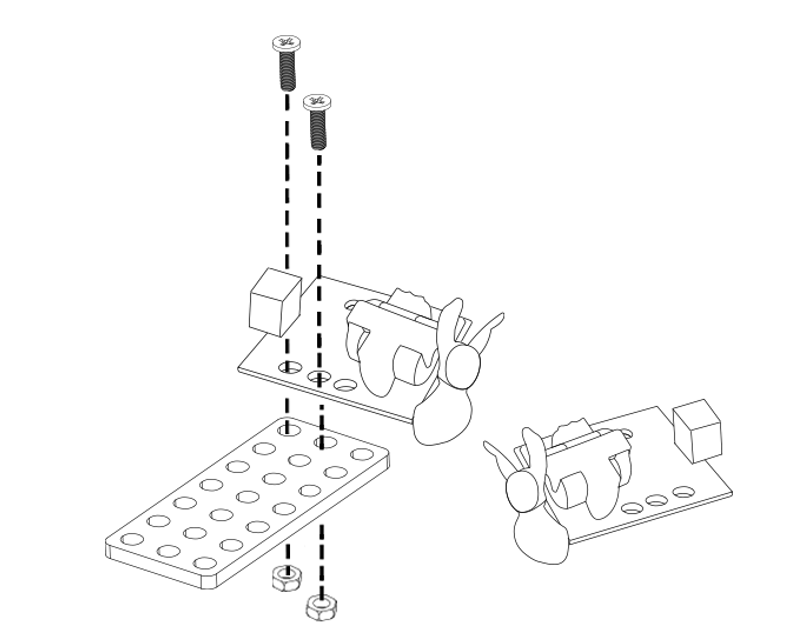
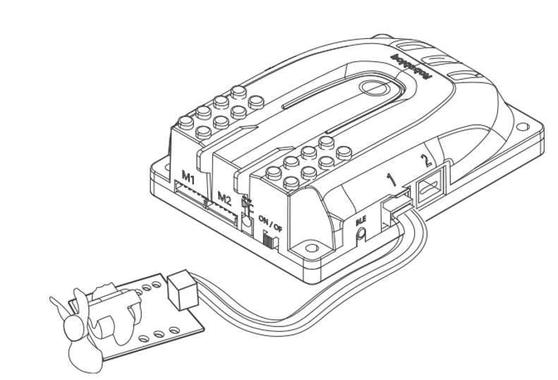
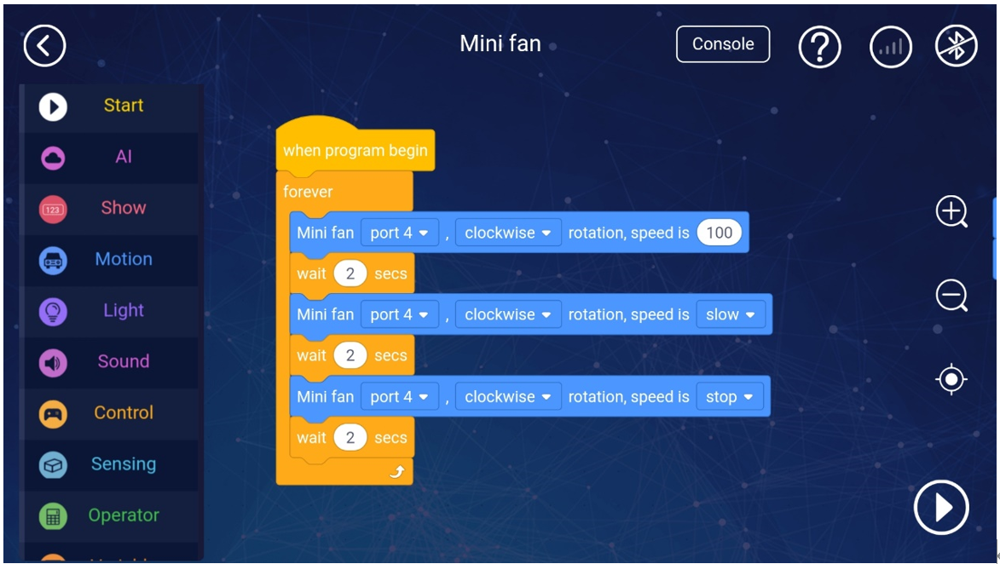

# 1. Mini Fan 

# Mini Fan
#  

( Pictures to be updated )

## Ⅰ.Overview
The mini fan module consists of a 130 DC motor, fan blades, drive circuit and red RJ11d port. Users can program and control the fan's rotation speed and direction in the Myqode software. This module transmits the value to the Qmind series main control board through the RJ11 cable. Note: on the motherboard is connected to the orangecolour interface to function properly. You can use this module to build small applications such as fire-fighting robots and smart fans.

## Ⅱ. Specifications
| Supply   voltage: 5 V | DC |
| --- | --- |
| Motor driving voltage: 9V | DC |
| voltage range: | 0-   12 V |
| No-load speed: | 16000   ± 10% rpm |
| No-load current: | 90   ± 10% mA |
| Operating temperature: | -10   ℃ ~ 50 ℃ |
| Working humidity: | 5%   ~ 85% RH |

## Ⅲ. characteristics
a)    The mini fan supports Arduino IDE programming and provides runtime libraries to simplify programming.

b)   The mini fan is available for Robobloq-APP and MyQode-PC GUI operating based on scratch,  suitable for all ages.

 

c)    It can be used for installation with M4 holes, compatible with Robobloq metal-related robots and Lego blocks.

 

d)    Having an RJ11 interface makes it convenient to connect to any black port on the Q-mind series motherboards. (Both Q-mind and Q-mind plus included)

 

e)  After the robot successfully connects to the PC, the sensor name will pop out automatically, and the sensor name can be seen in the console on the APP side.

 

## Ⅳ. Method of use.
### a) Assembly.     
The module has six M4 screw mounting holes, which can be used to fix the module to the metal platform of the Magic Rock robot. It is also compatible with the LEGO system round hole latch.

### b) Connecting.     
Connect this module to the red RJ11 port of the Qmind series main control board:

 

 

After the connection is completed, the name of the connected module will pop up on the PC.

### c) Programming statement block     
[Stage interaction] Connect the PC to the robot, and then find the "Magic Lock" instruction in the character Sprite. Click each block to debug the robot online and debug the status of the control module in real-time.

[Online and offline programming] The sentence block of the mini fan module is in the "action" sentence block;

 

### d) Statement block interpretation     
1.           Mini fan control sentence block 1 (more precise speed adjustment)

 

|     | Parameter:   Port | output   value |
| :---: | --- | --- |
| | Qmind   4 Qmind   plus range 1, 8 | Speed   0-250; clockwise /   counterclockwise |
|  |  |  |

2.             Mini fan control sentence block 2

|     | Parameter:   Port | output   value |
| :---: | --- | --- |
| | Qmind   range 4 Qmind   plus range 1, 8 | Stop   / low speed / medium speed / high speed; clockwise / counterclockwise |

 

### e) Application case     
 

**Overview for the case performance:** According to the above programming, the fan motor of port 4 can run for two seconds at a speed of 100, and then run for two seconds at a slow speed, stop for two seconds, and repeat the three instructions.

** **

**Instruction steps:**

1.             Connect the mini fan sensor to port 3 of the main control board

2.             Set the program as shown above

3.             Press the run button in the lower right corner to start the program.

 

 

---

 

> 更新: 2020-12-02 01:12:21  
> 原文: <https://www.yuque.com/robobloq/gb7mwf/hbdfw3>