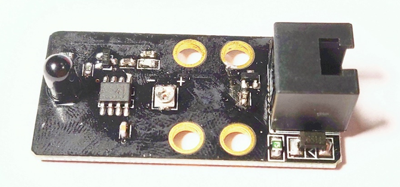
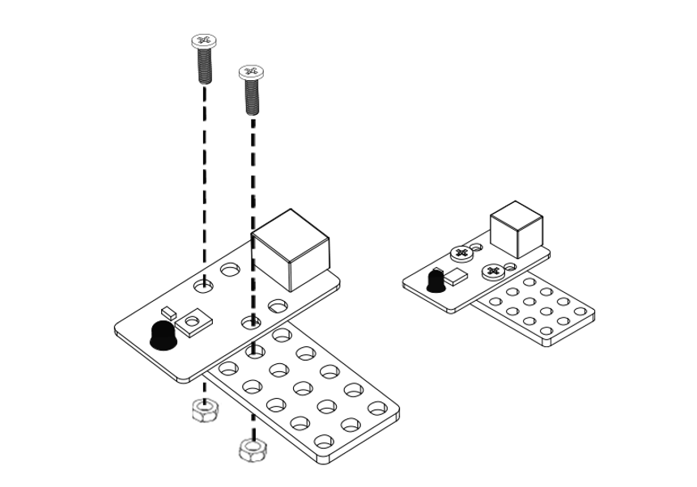
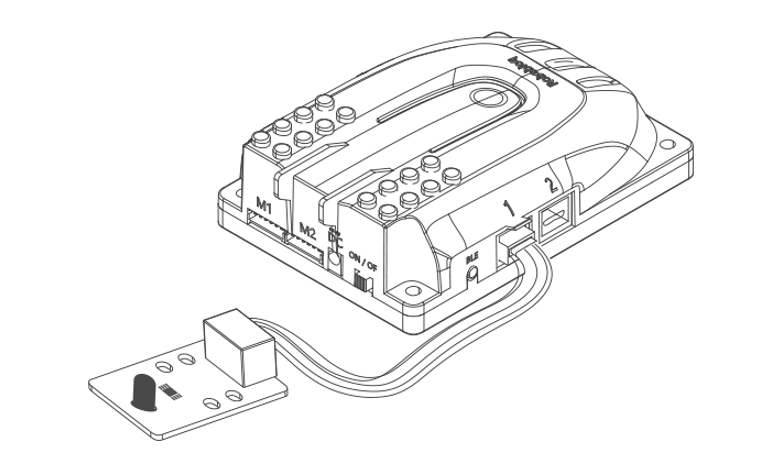
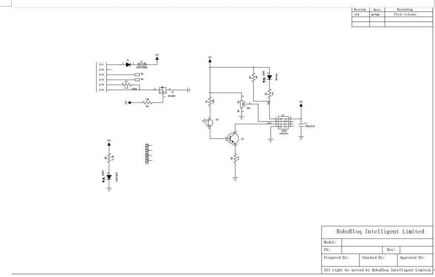

# 2. Flame Sensor

# Flame Sensor

## I. Overview
Flame sensors can be used to detect fire or light sources in the wavelength range of 760 nm to 1100 nm. The detection angle can reach 60 degrees. When a flame is detected, its blue indicator will light up and output the intensity value of the flame from 0 to 1024. It can be applied to small safety monitoring items such as fire-fighting robots and flame alarms. This module could be connected to any black port on the Q-mind series motherboard through the RJ11 port, and the name of the inserted sensor can be viewed in the software. 

Note: The module circuit board cannot be used directly in the burning flame, the sensor can safely work at a certain distance from the flame.

## Ⅱ. Specifications
| Operating   Voltage | 5V   DC |
| --- | --- |
| Detection band | 760   nm to 1100 nm |
| Detection angle | 60   ° |
| Feedback time | 15μs |
| Control mode | Digital   and analogue ports |
| Module size | 50 * 24 * 15 mm |

** **

## Ⅲ. characteristics
a)     When the flame height is 5cm, the detection distance should be controlled over 1m ;       

b)    Anti-reversed-voltage- polarity: It could be protective for the sensor even when connecting the wire to the motherboard reversely or wrong.

c)      Having an RJ11 interface makes it convenient to connect to any black port on the Q-mind series motherboards. (Both Q-mind and Q-mind plus included)

d)      It can be used for installation with M4 holes, compatible with Robobloq metal-related robots and Lego blocks.

e)     It provides outputs for digital and analogue signal.

f)      The flame sensor supports Arduino IDE programming, and provides runtime libraries to simplify programming;

 

g)    The sensor is available for Robobloq-APP and MyQode-PC GUI operating based on scratch,  suitable for all ages;

 

h)   After the robot successfully connects to the PC, the sensor name will pop out automatically, and the sensor name can be seen in the console on the APP side.

** **

## Ⅳ.Method of use
### a) Assembly.     
The module has four M4 screw mounting holes, which can be used to fix the module to the metal platform of the Magic Rock robot, and it is also compatible with the LEGO system round hole latch.

### b) Connection
Connect this module to the black RJ11 port of the Qmind series main control board:

 

 

After the connection is completed, the name of the connected module will pop up on the PC end.

 

### c) Programming statement block     
**[Stage interaction] **Connect the PC to the robot, and then find the "Costume" in the lower right,  and then find “robot” from the left column.

s  

 Click each block to debug the robot online in real-time.

**[Online and offline programming] **The sentence block of the flame sensor module is in the "sensor" sentence block when you click “device”; Also when you click “costume”,  you can find the coding block to start flame sensor at the “robot” row in the left column on the screen.

### d) Statement block interpretation     
1.           Return value statement block 

|     | Parameter: Port | output value |
| :---: | --- | --- |
| | Qmind   1, 2, 3 Qmind   plus range 2   ~ 7 | From 0   to 1023 |

 

### e) Application case     
Overview: When there is no flame, the green light of the robot is always on. When the intensity of the flame is greater than 2 detected by the robot sensor, the dual lights on the main board of the robot turn red, and a warning sound is emitted.

1.    Connect the flame sensor to port 3 of the main control board.

2.    Set the program as shown above.

3.    Press the “Run” button in the lower right corner to start the program.

 

## Ⅴ. Schematic

 

> 更新: 2020-12-02 01:12:21  
> 原文: <https://www.yuque.com/robobloq/gb7mwf/cpwgk9>