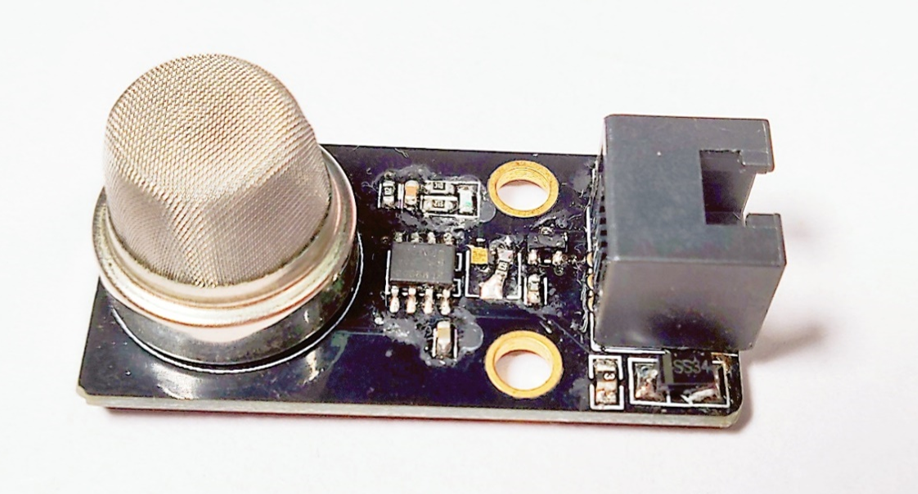
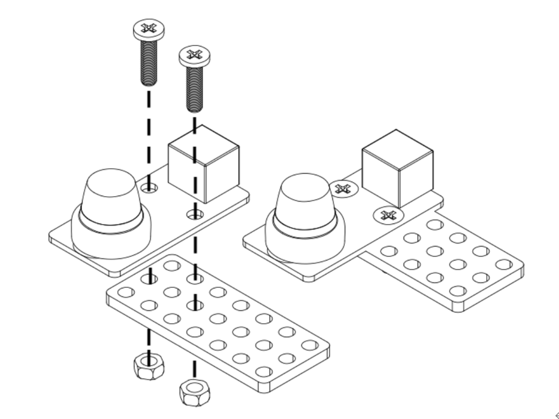
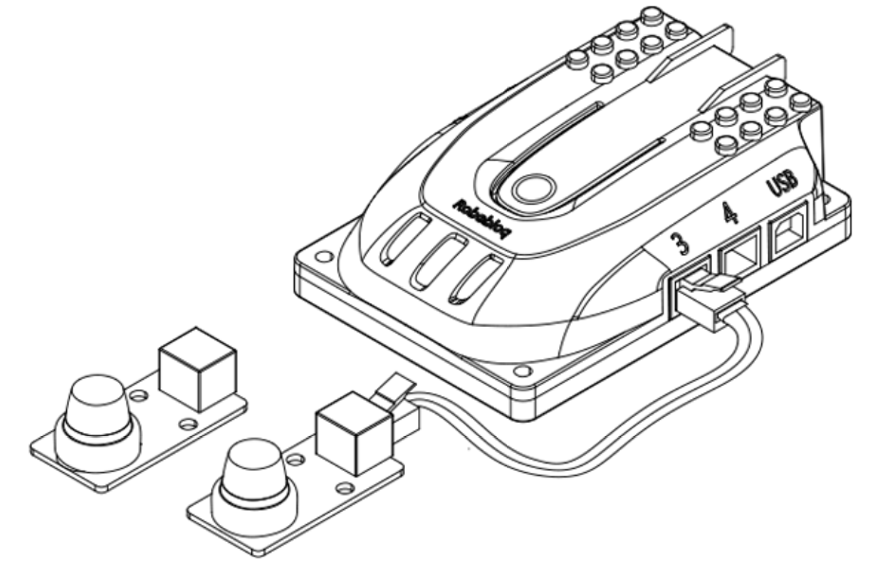
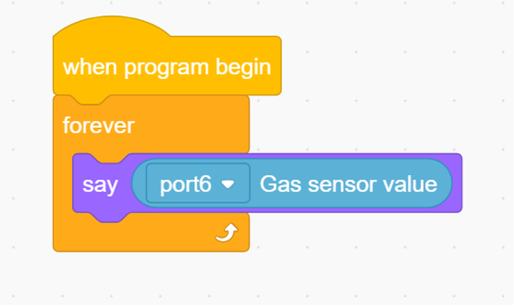

# 3. Gas Sensor 

# Gas sensor

## I. Overview             
Gas sensors include MQ2 smoke sensors with good repeatability, long-term stability, short response time, and durable performance. It is commonly used as a gas leak monitoring device in homes and factories and is suitable for detecting liquefied natural gas (LNG), butane, propane, methane, ethanol, hydrogen, smoke, etc. It can be connected to the motherboard of the Robobloq Q-mind series for more case operations. 

 

## Ⅱ.Specifications             
| Operating   Voltage | 5   V |
| --- | :---: |
| Working current | 100MA |
| Maximum current | 500MA |
| Operating temperature | -20 - 55 ℃ |
| Way of communication | Analog   signal |
| Module size | 50 * 24 * 20 mm |

 

 

## Ⅲ.Characteristics
 

a)    With reverse connection protection, the sensor could protect its IC even with the reverse connection to the battery.

b)    The  sensor supports Arduino IDE programming, and provides runtime libraries to simplify programming;

c)    The sensor is available for Robobloq-APP and MyQode-PC GUI operating based on scratch,  suitable for all ages;

d)    With two M4 hole positions, you can install additional metal parts or Lego according to your own needs. You can connect the sensor via M4 holes with  Q-mind metal parts with screws and nuts. You can also try to set the sensor on Lego via Lego’s pinholes.     

 

e)    Having an RJ11 interface makes it convenient to connect to any black port on the Q-mind series motherboards. (Both Q-mind and Q-mind plus included)

 

f)   After the robot successfully connects to the PC, the sensor name will pop out automatically, and the sensor name can be seen in the console on the APP side.

 

 

 

** **

## Ⅳ. Method of use
### a) Assembly
The block has a 2 x M4 mounting screw holes, the module can be secured by screws to the metal robot robobloq, also compatible with circular plug Lego system.

### b) Configuration 
The black RJ11 interface connected to Qmind and Qmind plus can help the sensor get power and communication to the motherboard.

 

### c) Programming statement block     
** **

**[Stage interaction] **Connect the PC to the robot, and then find the "Roboloq" instruction in the character Sprite. Click each block to debug the robot online and debug the status of the control module in real-time.

**[Online and offline programming]** The sentence block of the gas sensor module is in the "sensor" row in the left column.

 

### d) Statement block interpretation     
1.           Return value statement block (kind: sensor)

|      | ** ** **Parameter ****Ⅰ****: Port** | ** ** **output value** |
| :---: | --- | :---: |
| | **Qmind   1 ****, ****2 ****, ****3** **Qmind   plus ****ranges ****2 ~ 7** | ** ****Analog value:0 - 1023   ****Digital value:0 , 1** |

** **

** **

**Instruction steps:****  **

**1.    ****Connect the gas sensor to port 6 of the main control board.**

**2.  ****  ****Provided as the below block.**

**3.  ****  ****Press the “Run” button on the top right to start the program.**

 

 

**Overview for the case performance:**

**After starting the main control board of Roboloq, connect the gas sensor, and the little robot character on PC end will continue to sense the change of gas concentration and read the corresponding value.**

 

**Objective: To experience the process of gas detection by the Robobloq gas sensor.**

 

> 更新: 2020-12-02 01:12:21  
> 原文: <https://www.yuque.com/robobloq/gb7mwf/adnoua>