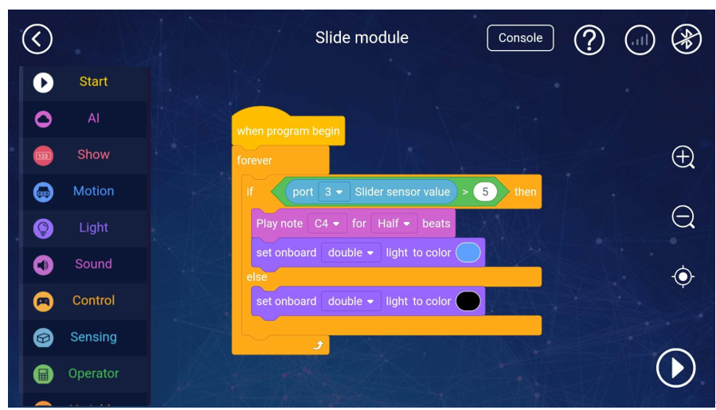

# 4. Linear Sliding Potentiometer

# Linear sliding potentiometer

## I. Overview
The slider potentiometer module contains a sliding potentiometer with a maximum resistance of 10K. The potentiometer is a resistance element with three lead-out ends, and the resistance value can be adjusted by sliding the slide bar. It can be used to adjust the motor speed, LED brightness, etc. The interface of this module is in black colour, indicating that it is an analogue signal interface, which needs to be connected to the black-labelled interface on the motherboard.

## Ⅱ. Specifications
| **Operating   Voltage** | **5V   DC** |
| --- | --- |
| **Signal mode** | **Single   analogue output** |
| **Module size** | **50 ***** 24 * 25 mm** |
| **Working current** | **15mA** |
| **Reading accuracy** | **±**** 2%** |
| **Service life** | **15,000   times** |

## Ⅲ. characteristics
a) The hole of the module is used to fix the part of the Moloc metal platform, and it is also compatible with Lego;     

b) Simulate the voltage of the potentiometer to determine the pushing position of the slider ;      

c) With reverse connection protection, the reverse power supply will not damage the IC;      

d) Support Arduino IDE programming, and provide runtime libraries to simplify programming;      

e) Supports Robobloq-APP / MyQode-PC graphical programming, suitable for all age users.      

f) It is convenient to connect using RJ 11 interface. This module can be connected to any black port of Qmind series motherboards.      

## Ⅳ.Method of use
### a) Assembly.     
The module has 3 M4 screw mounting holes, which can be screwed to the metal platform of the Magic Rock robot, and is also compatible with the LEGO system round hole latch.

### b) Connection
Connect this module to any black RJ11 port of the Qmind series main control board:

 

 

After the connection is completed, the name of the connected module will pop up on the PC side; you can also see the module name in the console on the APP side.

### c) Programming statement block     
[Stage interaction] Connect the PC to the robot, then find the magic lock instruction in the character Sprite, click each sentence block to debug the robot online, and get the return value of the slider module in real-time. (Later, you can directly debug online in the robot character)

[Online and offline programming] The slider block statement block is inside the "sensor" block;

Slider bar

|    | Parameter one: port | return value |
| --- | --- | --- |
| | Qmind   range 1   ~ 3 Qmind   plus range 2   ~ 7 | Measuring range: 0-1023  ** ** |

** **

### d) Application case     
#### [APP-Robobloq sensor interacts with a robot]
**Overview for the case performance: **

When the power is turned on, if you move the slider to the right to a certain extent, the main control board will make a "beep" sound, and then the onboard light turns blue. The “beep” sound is reduced, and the onboard light of the main control board goes out.

** **

**Instruction steps**

1.  Connect the light sensor to port 3 of the main control board

2.  Set the program as shown above

3.  Press the run button in the lower right corner to start the program.

 

## V. Schematic

> 更新: 2020-12-02 01:12:21  
> 原文: <https://www.yuque.com/robobloq/gb7mwf/pkyvla>