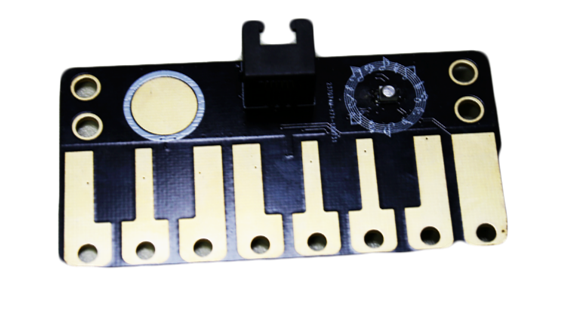
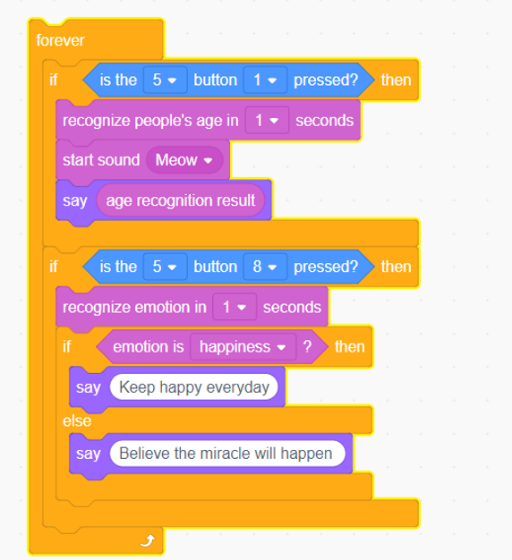
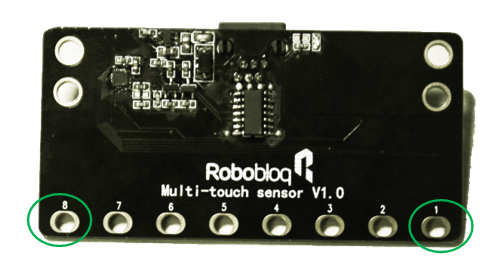

# 5. Multi-touch Sensor

# Multi-touch Sensor
** **

 

 

## Ⅰ.Overview
The multi-touch sensor has many touch sensors which will detect the status when the points are touched, the lights will be on when touching the points. At the same time, you can use the alligator clip or the wire to extract the touching points from the sensors, For example, extract the touching points to the fruits, this will expand the utility of the sensors.

The sensor will adjust the threshold value intellectually, it will reset the threshold value when turning off the electricity to make sure it will detect the touching action sensitively when connecting the points to the electrically conductive materials. For example, it will have an effect like the distance touching when the touching sensitive value is high.

 

## Ⅱ. Specifications
|  Working   Voltage | **5V** |
| --- | :---: |
|  Working current  | **30ma** |
|  Maximum current  | **100MA** |
|  Working temperature  | **-25-55** |
|  communication method | **IIC** |
|  Module size | **100 x 50 x 15 mm** |

** **

## Ⅲ.Characteristics
Principles:

It uses the electric capacity to detect, there is the original electric capacity Cp between the touching points and the earth.  When the body or other conductors get close to or touch the multi-touch points, The equivalent electric capacity which between touching points and earth will change correspondingly compared to the original electric capacity, and the MCU will detect the points which be touched. Because the touching judgement is based on the detection of electric capacity changes. So it will detect when the sensor not be touched.

a)    The light sensor supports Arduino IDE programming and provides runtime libraries to simplify programming.

 

b)   The sensor is available for Robobloq-APP and MyQode-PC GUI operating based on scratch,  suitable for all ages.

 

c)    It can be used for installation with M4 holes, compatible with Robobloq metal-related robots and Lego blocks.

 

d)    Having an RJ11 interface makes it convenient to connect to any black port on the Q-mind series motherboards. (Both Q-mind and Q-mind plus included)

 

e)  After the robot successfully connects to the PC, the sensor name will pop out automatically, and the sensor name can be seen in the console on the APP side.

 f)  It supplies digital and analogue export ports

 

## Ⅳ. Method of use
 

### a) Assembly     
It has 4 mounting holes. When setting up, kindly pay attention to get metal parts away with components on the circuit board in case that component damage or short circuit happens. 

**(Missing pictures)**

** **

### b) Connection    
The black RJ11 interface connected to Qmind and Qmind plus can help the sensor get power and communication to the motherboard.

**(Missing pictures)**

** **

 

After the connection is completed, the name of the connected module will pop up on the PC side, and the corresponding port can also be checked in the APP console.

After the connection is completed, the name of the connected module will pop up on the PC end.

 

### c) Statement block interpretation    
**[Stage interaction] **Connect the PC to the robot, and then find the "Costume" in the lower right,  and then find “robot” from the left column.

Click each block to debug the robot online in real-time.

**[Online and offline programming] **The sentence block of the flame sensor module is in the "sensor" sentence block when you click “device”; Also when you click “costume”,  you can find the coding block to start flame sensor at the “robot” row in the left column on the screen.

### d) Programming statement block     
| **** ** **    | ** ** ** ** **Reference value: ports ** | ** ** ** ** **Output value** |
| :---: | --- | --- |
| | **Qmind 123** **Qmind plCus2~7** **Qmind plus range2-7** | **Boolean value** ** ** |

### e) Application case
### 
#### i. Instruction steps:
**1.  ****Connect the multi-touch sensor to the 3****rd**** port in the motherboard**

**1.  ****Set up the coding program as above **

**2.  ****Click the process button to start the coding**

** **

**PS: please do not touch other parts in the multi-touch  sensor when you touch round pins**

 

** **

#### ii. Overview for the case performance:
** **

**1.  ****It will show the age of the detector in the screen when touching the pin 1 in the sensors, and then broadcast  meow and  speak out the age**

**2.  ****The computer will detect the mood of the people if press Pin 8 in the sensor. If the operator is happy, it will say ****“****Kindly believe the miracle will happen****”**

** **

** **

** **

 

** **

> 更新: 2020-12-02 01:12:21  
> 原文: <https://www.yuque.com/robobloq/gb7mwf/gwnive>