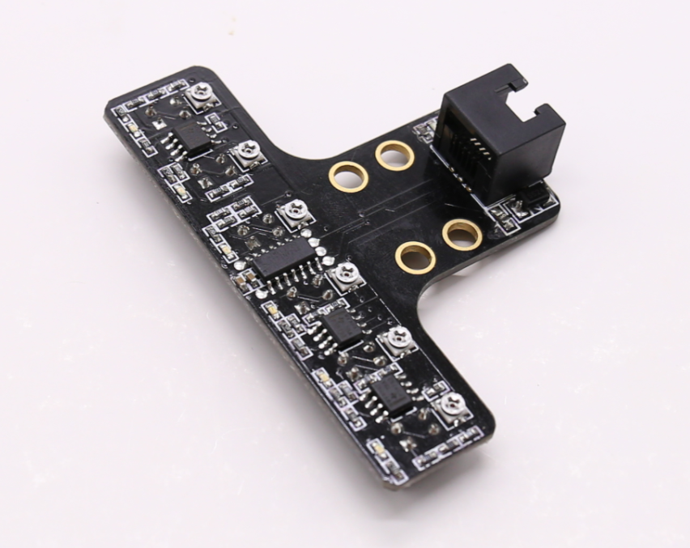

# 6.Six-way Line Follower Sensor

**1.Overview**

The line follower sensor can help the robot to track white lines or black lines (black lines on a white background or black lines on a white background can be detected). The module has two infrared sensors with low delay and can detect the status of ground lines in real time.

**2.Specification**

**3.Featrues**

a) Two on-board blue LEDs are used for detection feedback.

b) Note that this module is susceptible to natural light and has certain limitations on fields with large variations in ambient light.

c) Support Arduino IDE programming, and provide runtime to simplify programming.

d) Support Robobloq graphical programming for all ages.

e) The on-board gold-immersed  M4 mounting holes are easy to install and use the RJ11 interface for convenient connection.

**4.How to use?**

a) Assembly

With four mounting holes, be careful not to damage the components on the board or cause a short circuit during installation.

b) Wiring

It can be connected to the black ports of Qmind or Qmind plus board.

c) Programming blocks

d) Projects

Comming soon...

5.**Documents**

[**Schematic**](https://github.com/Robobloq2018/Open-source-hardware/tree/master/Electronic%20module)

> 更新: 2020-12-02 01:23:24  
> 原文: <https://www.yuque.com/robobloq/gb7mwf/pv4cdk>