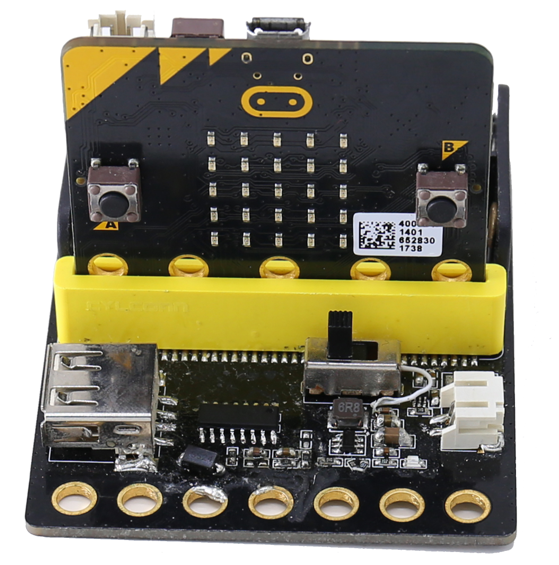
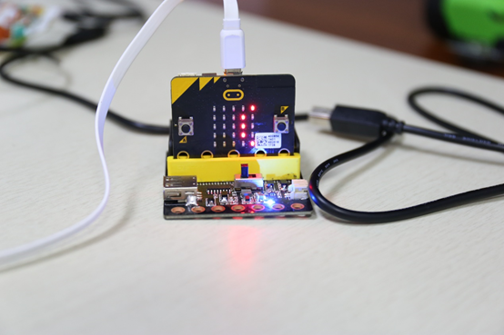
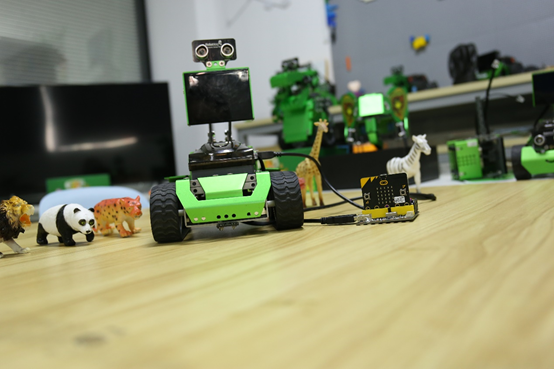
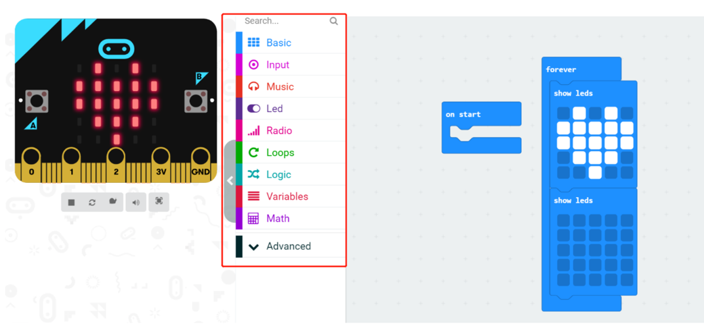
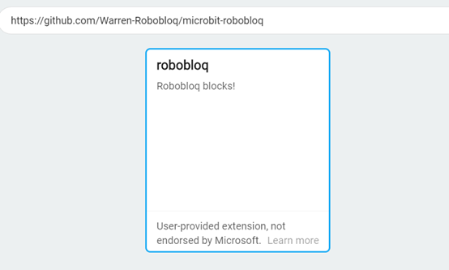
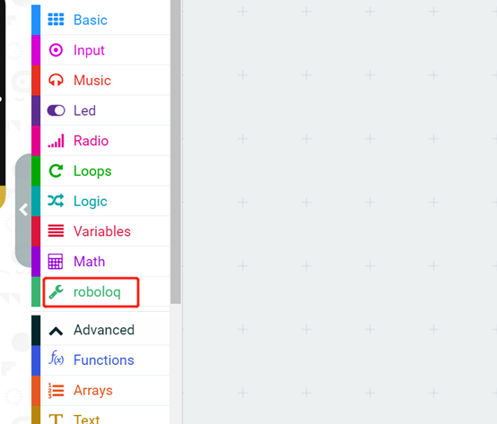
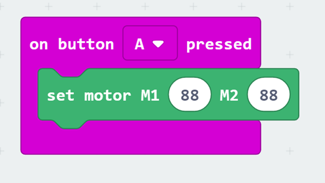
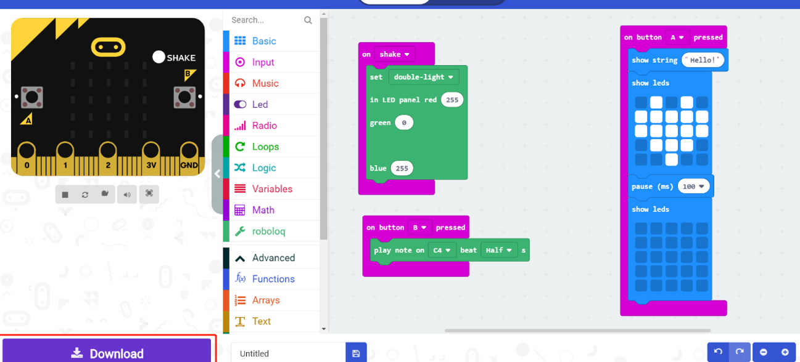
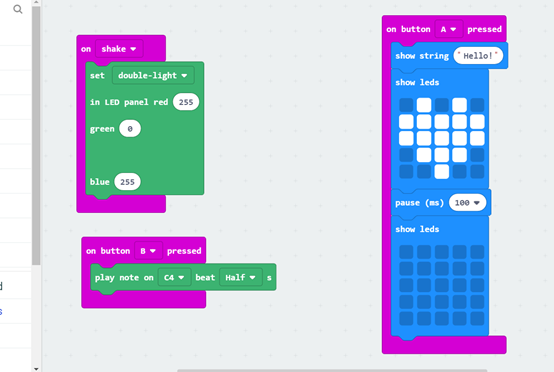

# 7-3. Micro:bit Adapter Board Level-3

# Mirco: bit Adapter Board
** **

 

## I. Overview
micro: bit is an entry-level development board designed by BBC for teen programming education. It supports the PXT graphical programming interface developed by Microsoft, without the need to download an additional compiler, and can be used under Windows, macOS, IOS, Android and other operating systems.

In order to facilitate the wiring of the micro: bit development board, we specially designed this expansion board. All pins and power of the micro: bit development board have been led out to the pins on the side of the expansion board.** **

##  
## Ⅱ. Specifications
| **Input   voltage** | **DC 3 .3   V** |
| --- | --- |
| **Pin   pitch** | **2.54mm** |
| **size** | **69 x 60 x**** 1 6 mm** |
| **weight** | **28.7 g** |

 

## Ⅲ. characteristics
a) Support Arduino IDE programming, and provide runtime libraries to simplify programming;

b) Support the programming of Robobloq, Makecode 's extended application, suitable for all ages;

c) M4 hole installation, compatible with Moloc metal platform and Lego round hole;

d) At the same time, it is convenient to use the RJ11 interface to connect to any black port on the Qmind series motherboard;

e) After the robot successfully connects to the PC end, the sensor type name will automatically pop up, and at the same time, you can see the magic lock and the blocks related to the magic lock in the console of the Makecode.

 

## Ⅳ.Method of use
### a) Assembly    
It has eight mounting holes, not pay attention to the metal mounting member when the circuit board damage to the components above or cause a short circuit.

### b) Connection    
The black RJ11 interface connected to Qmind and Qmind plus can get power and communication.

**Suggestion: Use a relatively long data cable to connect the micro: bit expansion board and the magic rock robot.**

 

**c ) Expansion board use: When the expansion board is used offline (that is when controlling the Magic Rock robot), a battery needs to be added. When uploading the program in makecode to the micro: bit, it is not necessary to use the expansion board.**

Missing picture

 

 

### c) Programming statement block
1.      Micro: few programming statements in the block link to this page: [HTTPS: // makecode. Micro: bit .org / # Editor](https://translate.google.com/translate?hl=zh-CN&prev=_t&sl=auto&tl=en&u=https://makecode.microbit.org/%23editor#editor) in, each colour corresponds to a different module, which module you want to find, as long as the module which corresponds to the colour look that can.

 

2.     If you want to find the block of ‘robobloq’, you can click "Extension" in "Settings", then enter **https://github.com/Warren-Robobloq/microbit-robobloq**, and then you can see the expansion module of "Morlock" If you want to know the other module parameters of Robobloq robot, you can refer to the instructions of other electronic modules.

3.     If you want to make the micro: bit drive the robot, the range of the Moloc robot motor is -99 -99.

 

**If the input value exceeds 100 or is less than -100, the computer defaults the input value to ****zero****.**

 

             

### d) Application case    
1.     In the case process, you must first connect the micro: bit to the official Makecode editor using a USB SB : [https: // makecode. ](https://translate.google.com/translate?hl=zh-CN&prev=_t&sl=auto&tl=en&u=https://makecode.microbit.org/%23editor#editor)[Micro: bit ](https://translate.google.com/translate?hl=zh-CN&prev=_t&sl=auto&tl=en&u=https://makecode.microbit.org/%23editor#editor)[.org / # editor](https://translate.google.com/translate?hl=zh-CN&prev=_t&sl=auto&tl=en&u=https://makecode.microbit.org/%23editor#editor), (Note that you must edit the code in Makecode Programming on the server-side, then click "Download", upload the written program hex file to the micro: bit ( E ) **(note that the drive letter will change due to the number of external devices connected to each computer. **) ) (For more detailed operations and questions, please see [https: // ](https://translate.google.com/translate?hl=zh-CN&prev=_t&sl=auto&tl=en&u=https://microbit.org/guide/quick/)[micro: bit ](https://translate.google.com/translate?hl=zh-CN&prev=_t&sl=auto&tl=en&u=https://microbit.org/guide/quick/)[.org / guide / quick /](https://translate.google.com/translate?hl=zh-CN&prev=_t&sl=auto&tl=en&u=https://microbit.org/guide/quick/) and [https: // makecode. ](https://translate.google.com/translate?hl=zh-CN&prev=_t&sl=auto&tl=en&u=https://makecode.microbit.org/faq)[Micro: bit ](https://translate.google.com/translate?hl=zh-CN&prev=_t&sl=auto&tl=en&u=https://makecode.microbit.org/faq)[.org / faq](https://translate.google.com/translate?hl=zh-CN&prev=_t&sl=auto&tl=en&u=https://makecode.microbit.org/faq)

 

 

2.      micro: bit can control Q-Mind and Qmind-Plus-related robots.

3. Micro: bit and Q-mind PLUS are both control boards, Micro: bit plays a more dominant role. 

**Micro: bit ****→**** Qmind Plus ****→**** Other sensors connected to Qmind Plus **

** **

** **

 

**Overview for the performance case**

**When the Micro: bit board vibrates, the Q mind Plus onboard dual lights appear purple. Press the micro: bit A key, the micro: bit board displays a beating heart shape. Press the micro: bit B key and the main control board plays C. 4- tone half-beat. **

** **

 

 

> 更新: 2020-12-02 01:12:21  
> 原文: <https://www.yuque.com/robobloq/gb7mwf/wlresy>