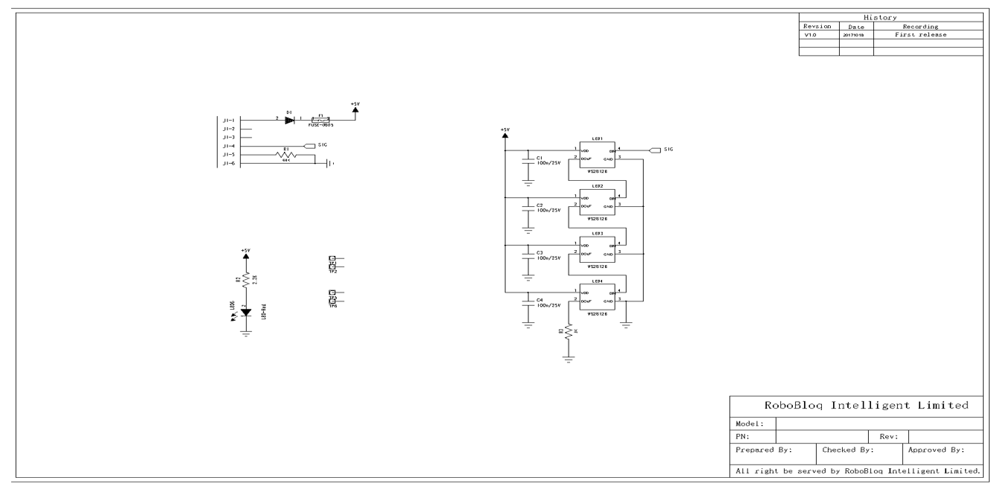

# 1. RGB LED Module

# RGB LED Module

 

## Ⅰ. Overview
RGB LED module contains four RGB LED colour lights. Each LED can be red(R)、green(G)、blue(B) through numbers。RGB LED have integrated control chips inside, one signal cable can realize the independent full-colour function. It has the feature of high brightness and adjustable, achieves the rainbow lights, meteor lights etc. By using RJ11 standard interface, it can connect to any black interface on the main board of Robobloq Robots, and show its name after connecting to PC.

## Ⅱ. Specifications
|  Operation   Voltage |  5V DC |
| --- | --- |
|  Number of LEDs |  4 x RGB LED |
|  Max current | Each 60mA， in total 240mA |
|  LED Type | WS2812-4 |
| Range | 0~255 |
|  Output Type | Analogue value |
| Operating Temperature | -25～+80℃ |
|  Angle | >140 Degree |
|  Module Size | 50 * 24 * 15 mm |

** **

## Ⅲ. Characteristics
a)     Three basic colours of each pixel can achieve 256 level of brightness display, easily complete the1600W+ colours with full-colour, and scanning frequency not less than 400Hz/s。

b)     Receive and decode data through cable,serially-concatenated port；

c)     Anti-reverse + overcurrent protection；

d)     Support MyQode-PC /Robobloq-APP coding，suitable for all ages；

e)     Easy to connect using RJ11 interface, compatible with Robobloq platform；

f)      M4 standard hole easily work with Lego building block；

g)     supports Arduino IDE programming, and provide runtime libraries to simplify programming；

## Ⅳ. Methods of use
### a)  Assembly
The module has four M4 mounting holes, and connect to Robobloq Robots through screw or lego block round screw.

### b)  Connection
The black RJ11 interface connected to Qmind and Qmind plus can help the sensor get power and communication to the motherboard。

 

 

### c)  Programming statement block
 

| ****   | Function | Parameter：Port |
| --- | --- | --- |
| | Control the speed of RGB show rainbow | Qmind range 1~3 Qmind plus range 2~7 |
|  | Control on or off of fours RGB lights | Qmind range 1~3 Qmind plus range 2~7 |
|    | The colour was combined with   red, green and blue. The number in a circle(0-255) stand for the per cent of   this colour. | Qmind range 1~3 Qmind plus range 2~7 |
|   | Control the colour of four small lights | Qmind range 1~3 Qmind plus range 2~7 |

 

####  Extension：RGB colour principle

Related link：[https://pixabay.com/zh/vectors/intersection-mix-colors-rgb-red-154782/](https://pixabay.com/zh/vectors/intersection-mix-colors-rgb-red-154782/)

RGB: Three origin colours { RGB（Red，Green，Blue）} mixed by different per cent to form colourful light.

 

(0, 0, 0)---Black

(255, 255, 255)---White

(255, 0, 0)----Red

(0, 255, 0)---Green

(0, 0, 255)----Blue

(255, 255, 0)----Yellow

(0, 255, 255)---Indigo

(255, 0, 255)---Magenta

 

 

### d)  Application case
**【****PC-Robobloq  Sensor interacts with Robot****】**

Overview：When power on，RGB module will display a rainbow，then off 1 second. The first LED light will sequentially show red, green and blue，then all become orange-pink. In the end, four small lights off one by one.

1.  Connect RGB LED module to port 3

2.  Setting the program as above picture

3.  Start the program

## V. Schematic

Related link

RGB colour table reference: http://tool.oschina.net/commons?type=3

 

> 更新: 2020-12-02 01:18:58  
> 原文: <https://www.yuque.com/robobloq/gb7mwf/mlyovn>