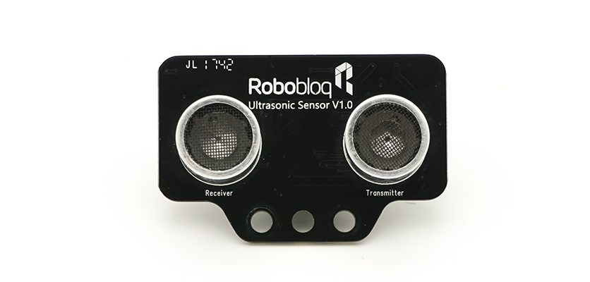
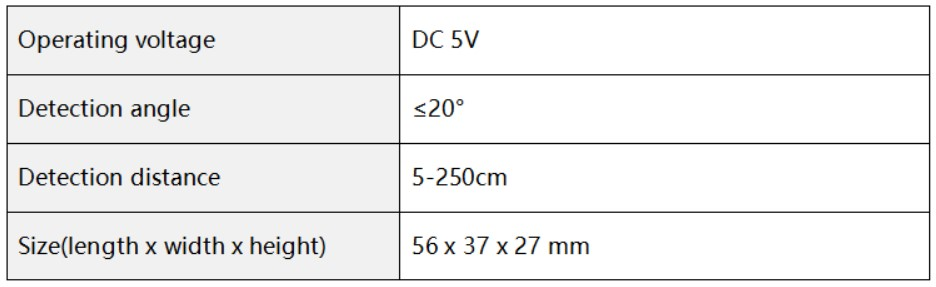
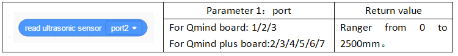

# 2. Ultrasonic Sensor

# Ultrasonic Sensor
## Ⅰ. introduction
The ultrasonic sensor is a module for detecting the distance between the obstacle in front and the module. It enables the robot to perceive the surrounding environment through the sonar like a bat. Through the control of the motor, the robot can automatically avoid obstacles.

## Ⅱ. Technical specifications
## Ⅲ. Charactersitics
a) Support Arduino IDE programming, and provide runtime to simplify programming.

b) Support Robobloq graphical programming for all ages.

c) It is convenient to connect using RJ11 interface.

## Ⅳ. Method of Use
### a) Assembly
With three mounting holes, be careful not to damage the components on the board or cause a short circuit during installation.

### b) Connection
Connect this module to the black RJ11 port of the Qmind series main control board.

### c) Statement block interpretation  

### e) Application case      
Cooming soon...

## Ⅴ. Schematic
**Click **[**Schematic**](https://github.com/Robobloq2018/Open-source-hardware/tree/master/Electronic%20module)** to view.**

> 更新: 2020-12-02 01:18:58  
> 原文: <https://www.yuque.com/robobloq/gb7mwf/gy4kzb>