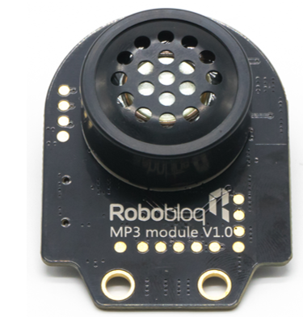

# 3. MP3 Module

# MP3 Module
 

 

## Ⅰ.Overview
A small and inexpensive MP3 module with its own speaker. The module has its own built-in speaker, the main control board of Robobloq’s Qmind series, and can also be controlled through a serial port as a module of Arduino UNO or any single-chip microcomputer with a serial port. The module itself integrates MP3, WAV, WMA hard decoding. Meanwhile, the software supports TF card driver and FAT16 and FAT32 file system. Music can be played through the serial port instruction of Mycode, or with mobile phone through the Bluetooth.

## Ⅱ.Specifications 
| Working voltage | **5V** |
| --- | :---: |
| Working current | **300MA** |
| Maximum current | **500MA** |
| Working temperature | **-25-55** |
| Communication mode | **Serial Communication****（****UART****）** |
| Module size | **58 x 43 x 28 mm** |

## Ⅲ.Characteristics
a)       With reverse connection protection, the reverse connection of power supply will not damage IC; 

b)       Support programming of Arduino IDE and provide runtime to simplify programming;

c)       Support Robobloq-app/MyQode-pc graphical programming, suitable for all age users.

d)       With two M4 hole sites, additional metal parts or building blocks can be installed according to user’s needs, which can be connected from the M4 hole to the metal position by screws and nuts, and fixed by bolt holes.

e)       RJ11 interface is convenient for connection. This module can be connected to any black port of Qmind series motherboard.

** **

## Ⅳ.Method of use
### a) assembly.
The module has three M4 screw assembly holes, which can be screwed to the metal platform of Robobloq robot, and also compatible with the other mainstream building blocks’ round hole bolt. 

### b) Cable Connection
Connect this module to the black RJ11 port of the Qmind series main control board: 

（When the connection is complete, the module’s name will pop up on the PC side）

#### 1. Programming Statement
 [stage interaction] after the robot is connected to the PC, find the "Robobloq" command in the “Sprite” and click each statement block to test the robot online and control the status of the module in real-time.

[online and offline programming] the statement block of the flame sensor module is in the "sensor" statement block;

#### 2. statement block interpretation 
1. Return value statement block (type: sensor)

| **Block Diagram** | ** ** **Parameter:   port** | ** ** **Output and Input   Values** |
| --- | --- | --- |
| ** ** ** ** ** **  | ** ** ** ** ** ** **Qmind 1****，****2****，****3** **Qmind plus Range: 2~7** | You can select the corresponding value of the   port connected to the MP3 module to operate, and you can select and control: 1. "play the song" 2. "pause" 3. "play the last song" 4. "play the next song" |
| ****  | **Qmind 1****，****2****，****3** **Qmind plus Range: 2~7** | You can select the corresponding value of the   port connected to the MP3 module to operate, and you can input the value to   adjust the volume  |

** **

** **

### c)  Application Case  

**1. Connect the MP3 electronic module to port 2 of the main control board.**

**2. Setup as shown in the program above.**

**3. Press the "run" key in the lower right corner to start the program.**

** **

**Implementation Result:**

**1. After launching the main control board, connect the MP3 electronic module, and then let the phone match the Bluetooth of MP3. After the pairing is completed successfully, play music on the phone at will. (Note: 1. First, use the mobile phone Bluetooth to pair with the main control board. 2. After the match, click "Settings" on the phone, select "Bluetooth", and then use the phone's BlueTooth to match Robobloq-mp3) **

** **

> 更新: 2020-12-02 01:18:58  
> 原文: <https://www.yuque.com/robobloq/gb7mwf/yowccm>