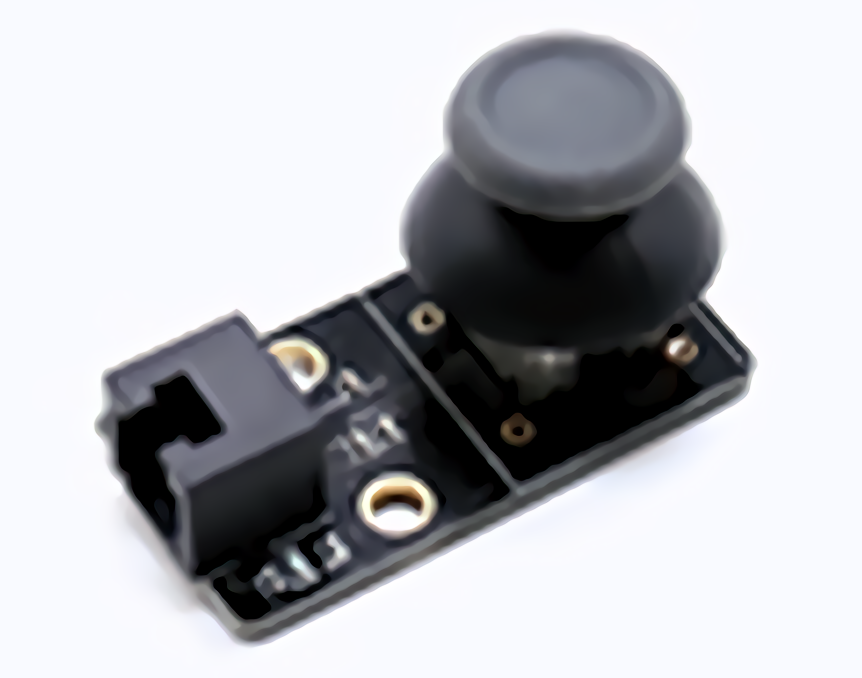
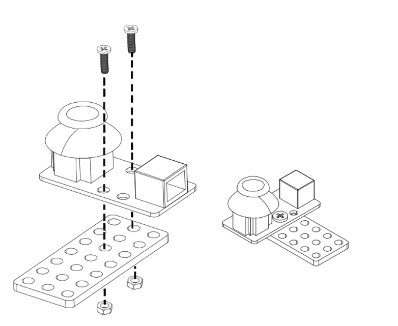
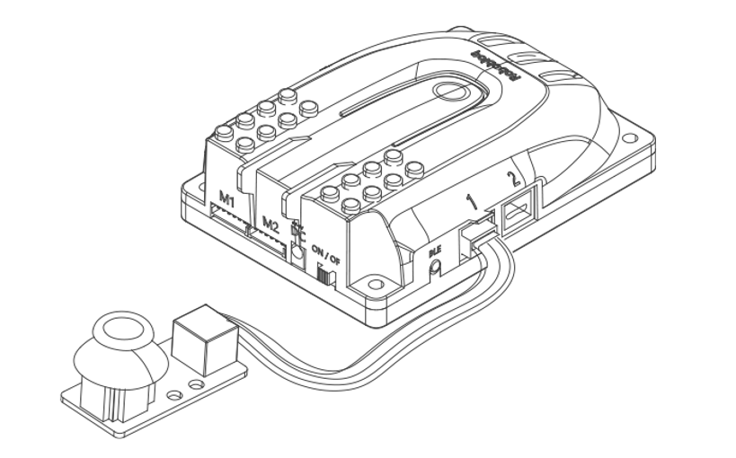
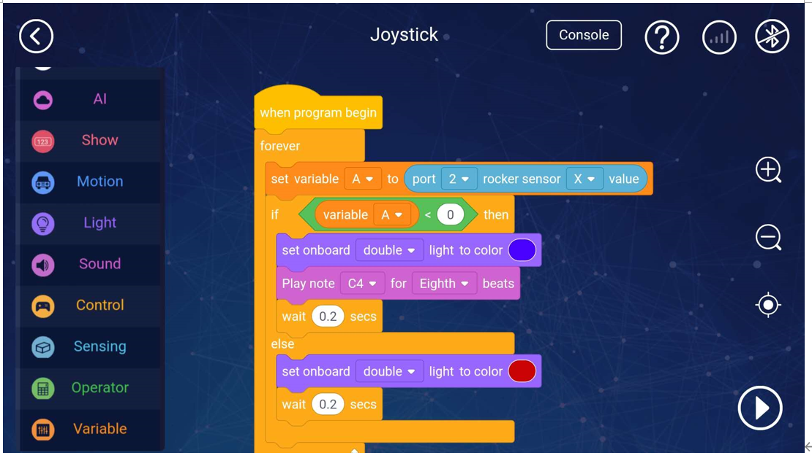
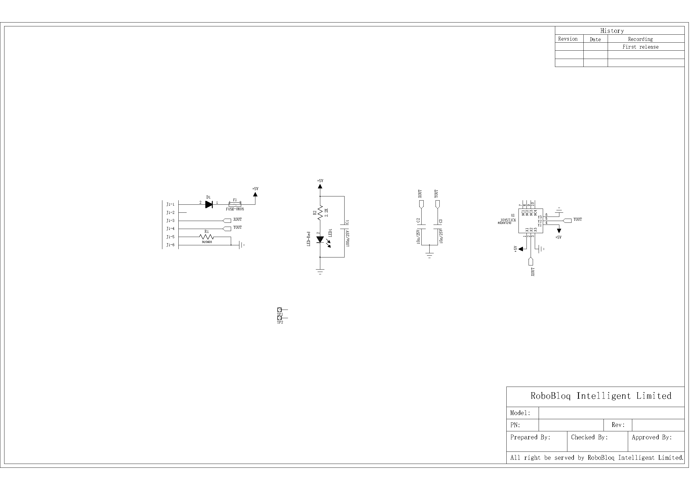

# 4. Joystick Module 

# Joystick
## 
## 
## I. Overview

The joystick module contains a cross joystick, which can be used to control the Magic Rock robot and Scratch stage interactive games. This module will output the value representing the position on the x-axis and y-axis respectively for user-defined programming. This module transmits the value to the Qmind series main control board through the RJ11 cable and connects to the black interface on the mainboard.

 

## Ⅱ. Specifications
| Operating   Voltage | 5V   DC |
| --- | --- |
| Signal mode | 2-axis   analogue output |
| Cross rocker | Consists   of two potentiometers and balance rings |
| Module size | 52 * 25 * 28 mm |

## Ⅲ.characteristics
a)  The balance ring divides the joystick displacement into horizontal movement (X) and vertical movement (Y), and there are silk-screen marks on the circuit board ;     

b)  It simulates the voltage of the potentiometer to determine the pushing position of the joystick;    

c)  Anti-reversed-voltage- polarity: It could be protective for the sensor even when connecting the wire to the motherboard reversely or wrong.

d)   Having an RJ11 interface makes it convenient to connect to any black port on the Q-mind series motherboards. (Both Q-mind and Q-mind plus included)

e)   It can be used for installation with M4 holes, compatible with Robobloq metal-related robots and Lego blocks.

f)   It provides outputs for digital and analogue signal.

g)   The joystick sensor supports Arduino IDE programming, and provides runtime libraries to simplify programming;

 

h)    The sensor is available for Robobloq-APP and MyQode-PC GUI operating based on scratch,  suitable for all ages;

 

i)   After the robot successfully connects to the PC, the sensor name will pop out automatically, and the sensor name can be seen in the console on the APP side.

 

## Ⅳ.Method of use.
### a) Assembly.     
The module has two M4 screw mounting holes, which can be used to fix the module to the metal platform of the Morlock robot, and it is also compatible with the LEGO system round hole latch.

### b) Connecting   
Connect this module to any black RJ11 port of the Qmind series main control board, as shown in the figure:

 

After the connection is completed, the name of the connected module will pop up on the PC side, and the corresponding port can also be checked in the APP console.

### c) Programming statement block     
[Stage interaction] Connect the PC to the robot, then find the magic lock instruction in the character Sprite, click each sentence block to debug the robot online, and get the return value of the joystick module in real-time. (Later, you can directly debug online in the robot character)

[Online and offline programming] The joystick module sentence block is in the "sensor" sentence block;

**1. Joystick numeric sentence block**

|     | Parameter one: port | return value |
| --- | :---: | :---: |
| | Qmind   range 1   ~ 3 Qmind   plus range 2   ~ 7 | Simultaneous output of X-axis and y-   position   value, the **range is plus or minus ****480** |

**2 . Rocker state determination statement block**

|     | Parameter one: port | return value |
| --- | :---: | :---: |
| | Qmind   range 1   ~ 3 Qmind   plus range 2   ~ 7 | True   or False |

### d) Application case     
#### [APP-Robobloq sensor interacts with a robot]
Overview: When the remote control joystick is moved to the left when the power is turned on, the main control board lights up blue and a "di di di" sound is issued. Will slowly stop.

** **

1.   Connect the remote sensing module to port 3 of the main control board

2.   Set the program as shown above. Setting variables first can make the program run more smoothly.

3.   Press the run button in the lower right corner to start the program.

 

**V. Schematic**

 

> 更新: 2020-12-02 01:18:58  
> 原文: <https://www.yuque.com/robobloq/gb7mwf/gih8p7>