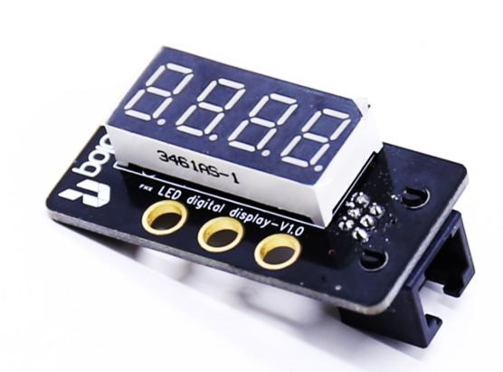
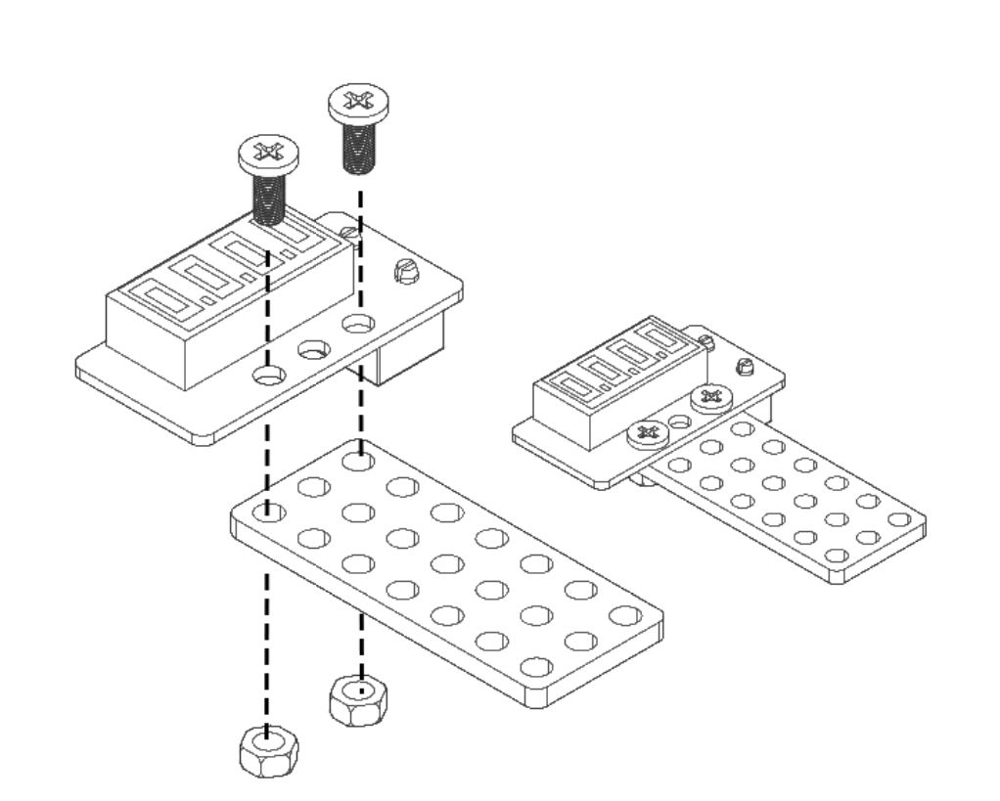
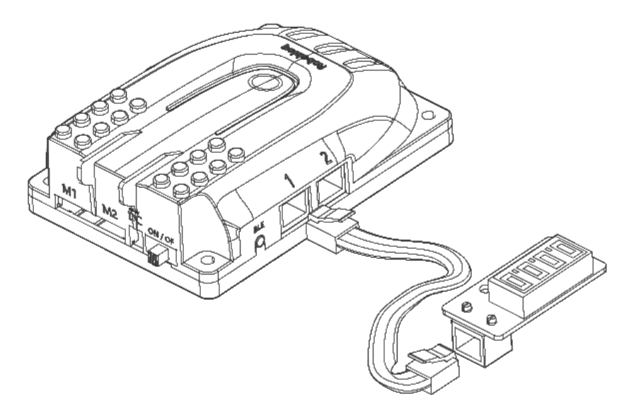
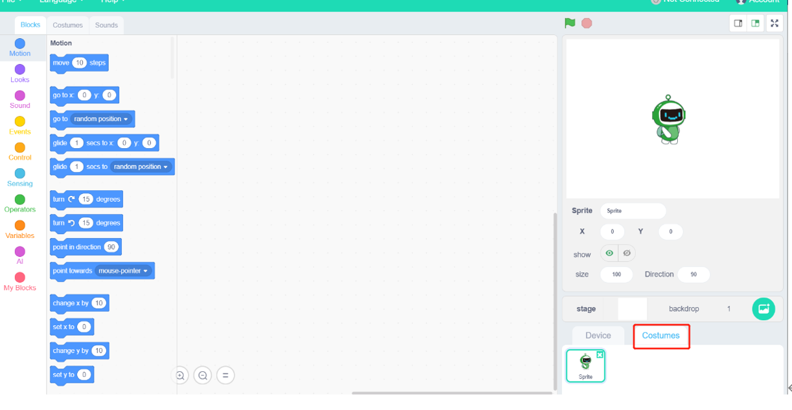
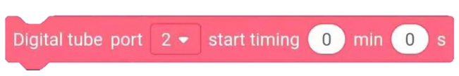
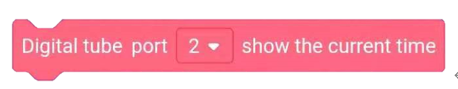
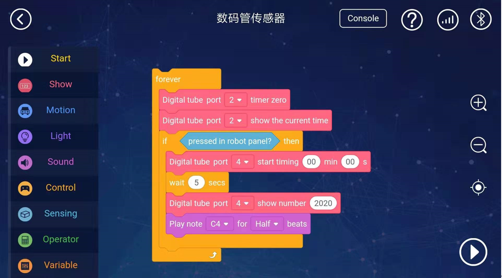

# 5. Digital tube Display 

** **

# Digital Tube Display
 

## Ⅰ.overview
** **

Robobloq Arduino 

Digital display uses the 4 digits of negative electrode nixie light, it can show numbers and a few special characters. You can use this module in the robot projects to do timing(show speed, time, minutes, temperature , distance etc) meanwhile, Robobloq will supply the easy-coding Arduino library, so end-user will control the digital display easily 

 

## Ⅱ. Specifications
|  Working voltage | **5V** |
| --- | :---: |
|  Working current  | **50Ma** |
|  Maximum current  | **100MA** |
|  Working temperature  | **-20-55** |
|  Communication method  | **IIC** |

** **

## Ⅲ.Characteristics
a) Anti-reversed-voltage- polarity: It could be protective for the sensor even when connecting the wire to the motherboard reversely or wrong.

b)  Having an RJ11 interface makes it convenient to connect to any black port on the Q-mind series motherboards. (Both Q-mind and Q-mind plus included)

c)   It can be used for installation with M4 holes, compatible with Robobloq metal-related robots and Lego blocks.

d)  It provides outputs for digital and analogue signal.

e)  The digital tube supports Arduino IDE programming, and provides runtime libraries to simplify programming;

f)   The sensor is available for Robobloq-APP and MyQode-PC GUI operating based on scratch,  suitable for all ages;

g)  After the robot successfully connects to the PC, the sensor name will pop out automatically, and the sensor name can be seen in the console on the APP side.

 

## Ⅳ.method of use 
### a) Assembly.     
The module has four M4 screw mounting holes, which can be used to fix the module to the metal platform of the Magic Rock robot, and it is also compatible with the LEGO system round hole latch.

****

### b) Connect.     
Connect this module to the black RJ11 port of the Qmind series main control board:

After the connection is completed, the name of the connected module will pop up on the PC end.

 

### c) Programming statement block     
[Stage interaction]** **Connect the PC to the robot, and then find the "Costume" in the lower right,  and then find “robot” from the left column.

 Click each block to debug the robot online in real-time.

[Online and offline programming]** **The sentence block of the digital tube module is in the "sensor" area,  Also when you click “costume”,  you can find the coding block to start digital tube moduleat the “robot” row in the left column on the screen.

### d) Statement block interpretation     
 

| **** **** ** block photos ** | ** ** ** ** **Reference value;ports ** | ** ** ** ** **Input value** |
| --- | --- | --- |
|  | **Qmind 123** **Qmind plus2~7** **Qmind plus range 2-7** | **0~9999** **0-9999    programmer input any 4 digits ** |
|  | **Qmind 123** **Qmind plus2~7** | **0~60** **Input 0-60, in 2 block ports, explanation: input   the time, and then digital display will do timing ** |
|    ** ** | ** ** ** ** ** ** **Qmind 123** **Qmind plus2~7** | ** ** ** ** ** ** **No input or output value, and start the   blocks, the timing will be 0** |
|  | **Qmind 123** **Qmind plus2~7** | ** ** **Input or output, start the blocks, the   digital display will show the current time ** |

** **

** **

### e) Application case     

**Instruction steps:**

**1.  ****Connect the digital display to the 4****th****port in the motherboard**

**2.  ****Set the coding like above **

**3.  ****Press the process button in lower of right.**

 

**Overview for the case performance:**

**1. After starting the main control board of Magic Lock, connect the digital tube electronic module. At first, the digital tube electronic module displays "0000", and then it displays the current time.**

**2. If the button of the main control board is pressed, the display of the digital tube electronic module displays the pattern of "00.00", then counts for 5 seconds, displays the pattern of "00.05", then displays the year of "2020", and plays the 0.5 C4 tones.**

** **

** **

> 更新: 2020-12-02 01:18:58  
> 原文: <https://www.yuque.com/robobloq/gb7mwf/gggyg6>