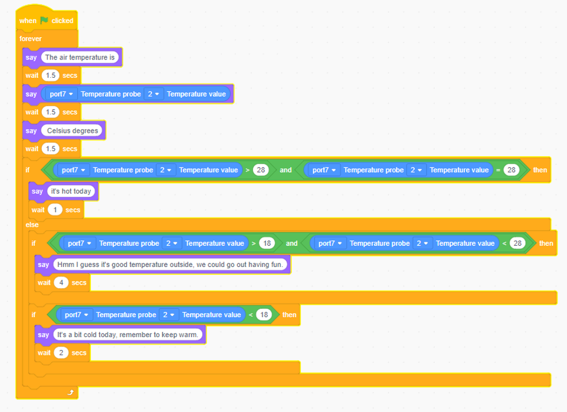

# 6. Temperature Probe

# Temperature Probe

## Ⅰ.Overview
Robobloq's temperature probe, a new generation of microprocessor-adapted smart temperature sensors, converts temperature signals directly into serial digital signals for microcomputer processing. The use of strict welding and packaging technology improves the measurement accuracy, prolongs the service life.

## Ⅱ.The Specification
| Working voltage | **5V** |
| --- | :---: |
| Working current | **30MA** |
| Maximum current | **1500MA** |
| Working temperature | **-20—55** |
| Communication mode | **Monobus** |
| Temperature range | **-55 —+125** |
| Probe diameter | **6mm** |
| Probe length  | **100cm** |

## Ⅲ.Characteristics 
A) With reverse connection protection, the reverse connection of power supply will not damage IC;

B) Support programming of Arduino IDE and provide runtime to simplify programming;

C) Support Robobloq-app/Myqode-PC graphical programming, suitable for all age users. 

## Ⅳ.method of use
### a) Assembly
Assemble with Robobloq’s temperature probe adaptor plate.

**（****missing pics****）**

### b) Cable Connection 
**（****missing pics****）**

**Connect this module to the Robobloq's temperature probe adaptor board and then to the Qmind series main control board**

When the connection is complete, the module’s name will pop up on the PC side

#### 1.    Programming Statement Block
 [Stage Interaction] After the robot is connected to the PC, find the "Robobloq" command in the Sprite and click each statement block to test the robot online and control the status of the module in real-time.

 

[Online and Offline Programming] The statement block of the flame sensor module is in the "sensor" statement block

#### 2.    Statement Block Interpretation
1. Return value statement block (type: sensor)

| ** **      | ** ** **Parameter: Port** | ** ** **Output and Input Values** |
| --- | --- | --- |
| | Qmind 1，2，3 Qmind plus Range 2~7 | You can select the corresponding value of the Qmind port   connected to the metal probe module for operation. This module can display   the value of the measured temperature...(values within...) |

** **

** **

### c) PC Application Case

** **

**Instruction steps****：**

1. Connect the temperature probe extension board to port 7 of the main control board.

2. Setup as shown in the program above.

3. Press the red flag in the upper right corner to run the program... 

** **

**Overview for the performance case:**

**1. After starting the main control board, connect the Qmind series, main control board, to the temperature probe expansion board module, and connect the temperature probe to the temperature probe expansion board.**

**2. Place the temperature probe in the air to measure the air temperature.**

**3. If the air temperature is greater than or equal to 28 Celsius degrees, Sprite will say, "it's a little hot today."**

**4. If 18 Celsius degrees< air temperature <28 Celsius degrees, Sprite will say: "Today's weather temperature is great for playing outside."**

**5. If the air temperature is less than 18 Celsius degrees, Sprite will say: "It's a little cold today, remember to put more clothes on." **

** **

** **

** **

> 更新: 2020-12-02 01:18:58  
> 原文: <https://www.yuque.com/robobloq/gb7mwf/uwmlgs>