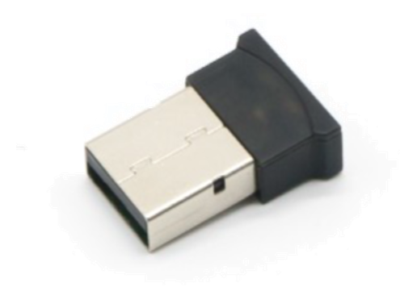
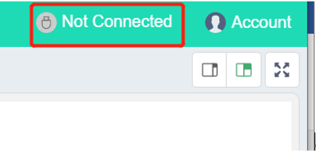
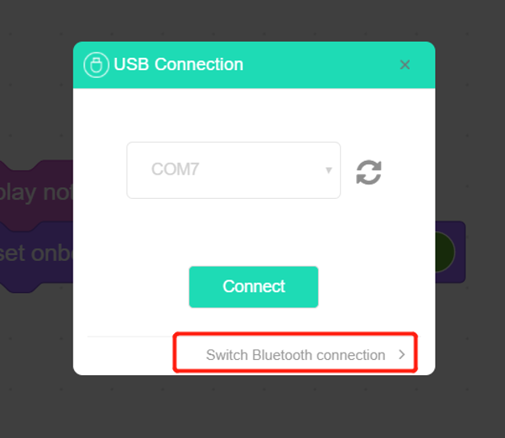
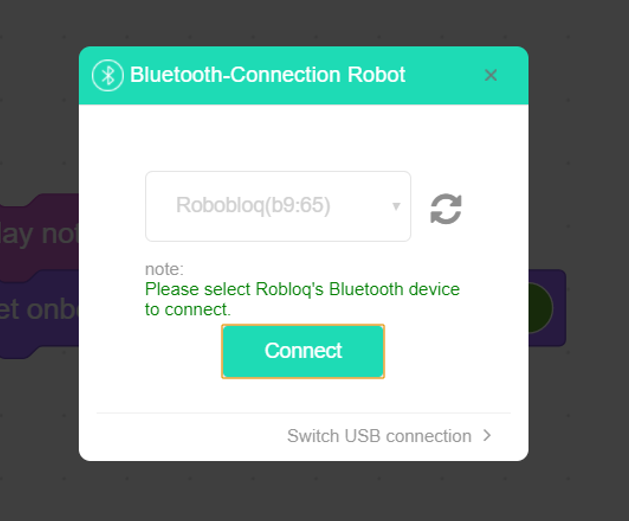
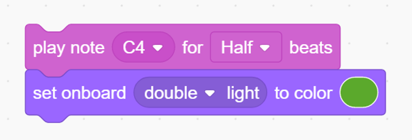
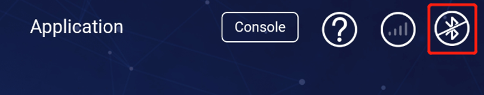

# 7. Dongle Module

# 
# Dongle module****
                  

                                                                    

## Ⅰ. introduction
Bluetooth dongle module connects your robot with Robobloq PC wirelessly (there is no requirement of USB wire during the process). The common Bluetooth adaptor is USB dongle that is for transmitting the data; there also is serial port dongle; for special users, there is voice dongle, and so on; per different protocol of Bluetooth module, there are 1.1, 1.2, 2.0, 3.0, 4.0. in general case, the newer one will be compatible of older.

## Ⅱ. Technical specifications
 

| Working voltage | **5V** |
| --- | :---: |
| Working   current | **50mA** |
| Max current | **100MA** |
| Working   temperature | **-20-55** |
| Communication   method | **Serial communication** |
| Block size | **18 x 10 x 5 mm** |
| Max range | **<10m** |
| Bluetooth   protocol | **BT4.0** |

 

 

## Ⅲ. Charactersitics
a)    with Reverse connection protection, the power source will not be damaged even if the connection is reversed.

b)    supporting Ardunio IDE programming, as well as runtime library for simplifying program.

c)    Supporting Robobloq-APP/MyQode-PC graphical programming, which is suit for the all-age user.

 

** **

## Ⅳ. Method of Use
### a) Assembling
directly insert the dongle into the proper PC USB port. (extension hub is working as well)

**（****missing pics****）**

### 
### b) Configuring
Turn on the Qmind and Qmind plus series.** ****（****missing pics****）**

Run mycode program on your PC, click the "not connected"

If the blue light is on, the module successfully gets connected to the motherboard.

【stage interaction】Connect PC to the robot, afterwards, choose Robobloq command in role Sprite. Click every block could manipulate robot online and set control state of a module in real-time.

### c) PC trying
**This case is only for practising Bluetooth module that connects robot and PC in a wireless way.**

**Instruction steps:**

**1.  ****Confirm that Bluetooth successfully connects with the robot**

**2.  ****Set robot as the figure above**

**3.  ****Click the flag on the right corner to run the program**

** **

**Overview for the performance case **

**When clicking the block, the robot will make C4 tone at One-half beat, and the onboard light will turn in to green.**

**Purpose: for practising Bluetooth dongle to communicate between PC and robot in a wireless way.**

**     **

### d) Mobile-end related instruction
** **

**1.  ****App Bluetooth connection: first, turn on the Bluetooth and navigator; then, click the Bluetooth icon to connect to a robot.**

**2.  ****Then you could do what you want via a dongle on mobile end to block-operating robots.**

 

** **

** **

** **

** **

** **

> 更新: 2020-12-02 01:18:58  
> 原文: <https://www.yuque.com/robobloq/gb7mwf/dg7nht>